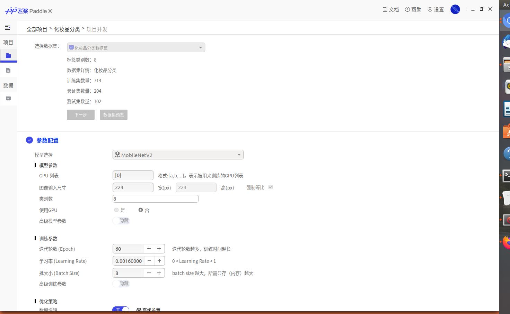
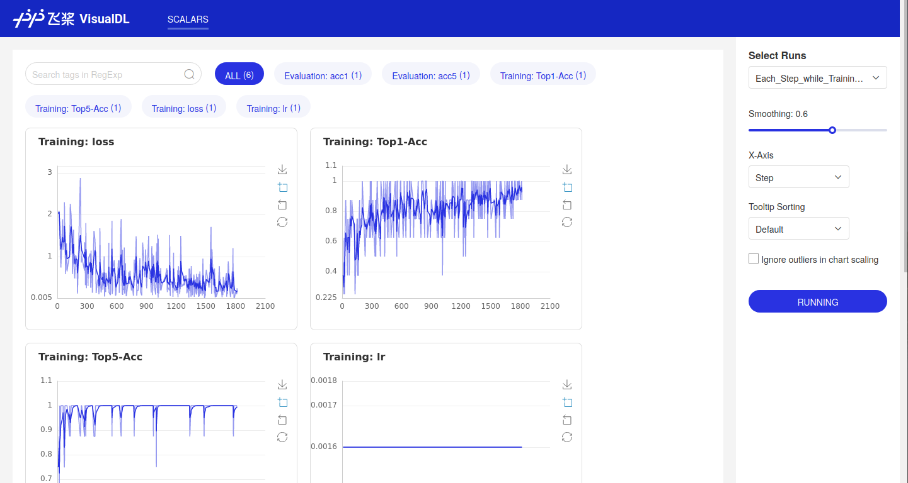
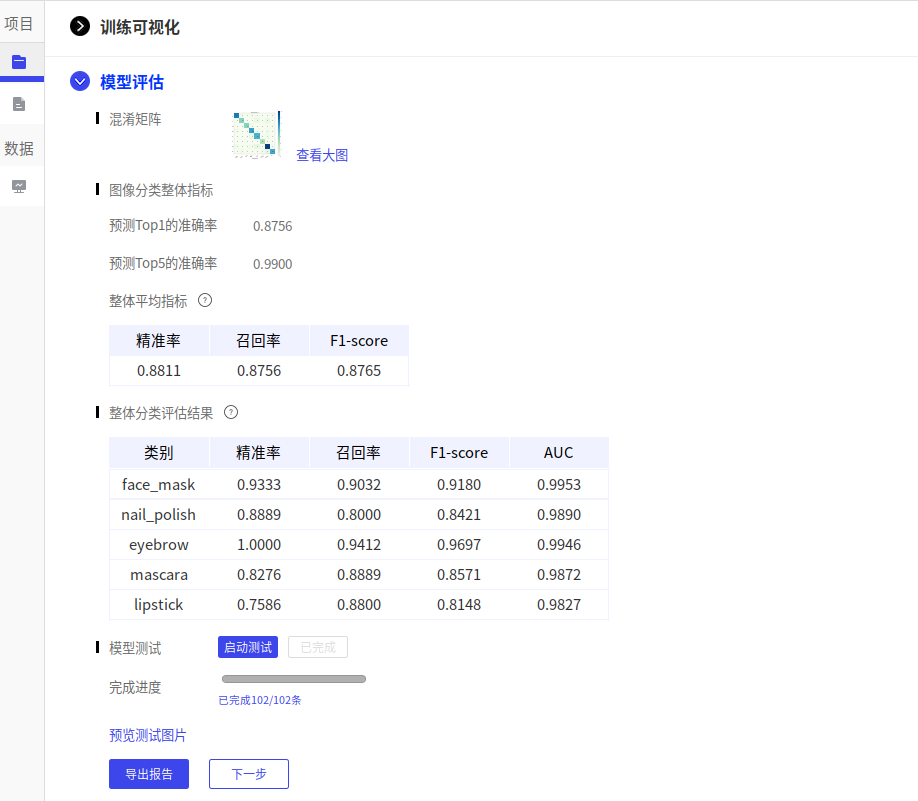

# PaddleX使用笔记

## GUI安装

在Ubuntu上安装PaddleX-GUI，只需要解压缩`PaddleX.zip`文件，然后到目录下打开命令行，运行下面的命令即可

```bash
./PaddleX
```

但是遇到了一个问题，就是我的Ubuntu有CUDA环境，驱动版本也符合要求，PaddleX就是无法识别，这样只能使用CPU训练，速度非常慢。

## GUI使用

PaddleX的理念非常好，开箱即用，即使是小白也能很快上手，这对于在企业中推广深度学习技术十分重要。

### 加载数据集

数据集可以根据要求准备好对应文件目录，然后可以直接导入。数据集要切分后才能在项目中使用，相当于将整个数据集处理的过程可视化了。


当然，个人觉得目前数据集功能还不完善，主要有下面几个问题，想必未来的版本会持续迭代完善更新

- 只支持PaddleCV库的图片分类、目标检测、图像分割等模型
- 目标检测数据集似乎必须是Pascal VOC标注的模式
- COCO数据集的标注目前只在场景分割中使用

### 项目训练

这里还是前面的问题，没有办法识别GPU，但是PaddleX将配置文件可视化在用户体验上效果很好，基于Flask技术栈，也比较轻量级。




VisualDL是最近Paddle生态的一大亮点，应该是直接对标Tensorboard，期待未来更加完善。



### 模型评估

训练结果的展示也比较直观，但是混淆矩阵的标题字体变成了方块——其实我的Ubuntu设置了中文字体，这个原因很可能是因为内置的matplotlib库没有设置中文字体路径的原因。启动PaddleX时也出现了报警：

```verilog
The MATPLOTLIBDATA environment variable was deprecated in Matplotlib 3.1 and will be removed in 3.3.
```



但是这里也发现了一个问题，就是如果训练完成，测试和模型导出未完成，下次启动时进入PaddleX，可以看到模型评估和训练日志，但VisualDL、模型测试、模型导出是无法继续执行的。