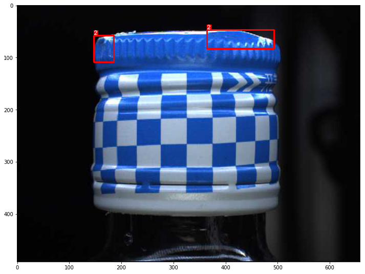

# PaddleDetection模型库与依赖安装
- 由于模型库迭代很快，注意master分支和release/0.1中configs里YAML文件有些写法不一样
- 本项目用的是release/0.1
- [PaddleDetection的文档](https://github.com/PaddlePaddle/PaddleDetection)比较完整，本文主要参考以下模块
## 使用教程

- [安装说明](PaddleDetection/docs/INSTALL_cn.md)
- [快速开始](PaddleDetection/docs/QUICK_STARTED_cn.md)
- [训练、评估流程](PaddleDetection/docs/GETTING_STARTED_cn.md)
- [数据预处理及自定义数据集](PaddleDetection/docs/DATA_cn.md)
- [配置模块设计和介绍](PaddleDetection/docs/CONFIG_cn.md)
- [详细的配置信息和参数说明示例](PaddleDetection/docs/config_example/)
- [IPython Notebook demo](PaddleDetection/demo/mask_rcnn_demo.ipynb)
- [迁移学习教程](PaddleDetection/docs/TRANSFER_LEARNING_cn.md)

## 模型库

- [模型库](PaddleDetection/docs/MODEL_ZOO_cn.md)


```python
# !git clone https://github.com/PaddlePaddle/PaddleDetection.git
```


```python
# !git clone https://github.com/cocodataset/cocoapi.git
```


```python
# 中文字体镜像
# !git clone https://gitee.com/mirrors/noto-cjk.git
```


```python
!cd cocoapi/PythonAPI && make install
```


```python
# 安装模型库依赖
!pip install -r PaddleDetection/requirements.txt
```


```python
!pip install scikit-image
```

```python
!pip install seaborn
```

```python
!pip install albumentations
```

## 数据准备


```python
# 解压数据集
!unzip data/data19028/round1_train1.zip -d ./data
!unzip data/data19028/round1_testA.zip -d ./data
```


```python
!mkdir PaddleDetection/dataset/coco/annotations
!mkdir PaddleDetection/dataset/coco/train2017
!mkdir PaddleDetection/dataset/coco/val2017
!mkdir PaddleDetection/dataset/coco/test2017
```


```python
!cp data/chongqing1_round1_testA_20191223/images/*.jpg -d PaddleDetection/dataset/coco/test2017
```


```python
# 数据清洗与数据增强相关工具库引入
%matplotlib inline
from urllib.request import urlopen
import os
import pandas as pd
import numpy as np
import imageio
import cv2
import json
from matplotlib import pyplot as plt
from pandas.io.json import json_normalize
import albumentations as A
from tqdm import tnrange, tqdm_notebook,tqdm
import time
```

# 数据集信息

[数智重庆.全球产业赋能创新大赛【赛场一】](https://tianchi.aliyun.com/competition/entrance/231763/information)
## EDA
完整内容参考：[数据的简单分析和可视](https://tianchi.aliyun.com/notebook-ai/detail?spm=5176.12586969.1002.15.125b13e2C6y39u&postId=86218)


```python
# 载入标注json文件
with open('data/chongqing1_round1_train1_20191223/annotations.json') as f:
    a=json.load(f)
```


```python
co=0
for c in a['annotations']:
    if c['image_id']==2162:
        co+=1
co
```


    21


```python
print('标签类别:')
print('类别数量：',len(a['categories']))
a['categories']
```

    标签类别:
    类别数量： 11


    [{'supercategory': '瓶盖破损', 'id': 1, 'name': '瓶盖破损'},
     {'supercategory': '喷码正常', 'id': 9, 'name': '喷码正常'},
     {'supercategory': '瓶盖断点', 'id': 5, 'name': '瓶盖断点'},
     {'supercategory': '瓶盖坏边', 'id': 3, 'name': '瓶盖坏边'},
     {'supercategory': '瓶盖打旋', 'id': 4, 'name': '瓶盖打旋'},
     {'supercategory': '背景', 'id': 0, 'name': '背景'},
     {'supercategory': '瓶盖变形', 'id': 2, 'name': '瓶盖变形'},
     {'supercategory': '标贴气泡', 'id': 8, 'name': '标贴气泡'},
     {'supercategory': '标贴歪斜', 'id': 6, 'name': '标贴歪斜'},
     {'supercategory': '喷码异常', 'id': 10, 'name': '喷码异常'},
     {'supercategory': '标贴起皱', 'id': 7, 'name': '标贴起皱'}]


```python
print('训练集图片数量：',len(a['images']))
print('训练集标签数量：',len(a['annotations']))
```

    训练集图片数量： 4516
    训练集标签数量： 6945


```python
total=[]
for img in a['images']:
    hw=(img['height'],img['width'])
    total.append(hw)
unique=set(total)
for k in unique:
    print('长宽为(%d,%d)的图片数量为：'%k,total.count(k))
```

    长宽为(492,658)的图片数量为： 4105
    长宽为(3000,4096)的图片数量为： 411


```python
ids=[]
images_id=[]
for i in a['annotations']:
    ids.append(i['id'])
    images_id.append(i['image_id'])
print('训练集图片数量:',4516)
print('unique id 数量：',len(set(ids)))
print('unique image_id 数量',len(set(images_id)))
```

    训练集图片数量: 4516
    unique id 数量： 2011
    unique image_id 数量 4516


```python
import pandas as pd
import seaborn as sns
import pandas as pd
import matplotlib.pyplot as plt
from matplotlib.font_manager import FontProperties
myfont = FontProperties(fname=r"/home/aistudio/noto-cjk/NotoSerifSC-Light.otf", size=12)
# plt.rcParams['font.sans-serif'] = ['SimHei']
# plt.rcParams['font.family']='sans-serif'
plt.rcParams['figure.figsize'] = (10.0, 10.0)
```


```python
##创建类别标签字典
category_dic=dict([(i['id'],i['name']) for i in a['categories']])
category_dic
```


    {1: '瓶盖破损',
     9: '喷码正常',
     5: '瓶盖断点',
     3: '瓶盖坏边',
     4: '瓶盖打旋',
     0: '背景',
     2: '瓶盖变形',
     8: '标贴气泡',
     6: '标贴歪斜',
     10: '喷码异常',
     7: '标贴起皱'}


```python
counts_label=dict([(i['name'],0) for i in a['categories']])
for i in a['annotations']:
    counts_label[category_dic[i['category_id']]]+=1
counts_label
```


    {'瓶盖破损': 1619,
     '喷码正常': 489,
     '瓶盖断点': 614,
     '瓶盖坏边': 656,
     '瓶盖打旋': 480,
     '背景': 1170,
     '瓶盖变形': 705,
     '标贴气泡': 443,
     '标贴歪斜': 186,
     '喷码异常': 199,
     '标贴起皱': 384}


```python
# import matplotlib.pyplot as plt
# import matplotlib
plt.rcParams['font.family']= myfont.get_family()
plt.rcParams['font.sans-serif'] = myfont.get_name()
plt.rcParams['axes.unicode_minus'] = False

label_list = counts_label.keys()    # 各部分标签
size = counts_label.values()    # 各部分大小
color = ['#FFB6C1', '#D8BFD8', '#9400D3', '#483D8B', '#4169E1', '#00FFFF','#B1FFF0','#ADFF2F','#EEE8AA','#FFA500','#FF6347']     # 各部分颜色
# explode = [0.05, 0, 0]   # 各部分突出值
"""
绘制饼图
explode：设置各部分突出
label:设置各部分标签
labeldistance:设置标签文本距圆心位置，1.1表示1.1倍半径
autopct：设置圆里面文本
shadow：设置是否有阴影
startangle：起始角度，默认从0开始逆时针转
pctdistance：设置圆内文本距圆心距离
返回值
l_text：圆内部文本，matplotlib.text.Text object
p_text：圆外部文本
"""
# patches, l_text, p_text = plt.pie(size, explode=explode, colors=color, labels=label_list, labeldistance=1.1, autopct="%1.1f%%", shadow=False, startangle=90, pctdistance=0.6)
patches, l_text, p_text = plt.pie(size, labels=label_list, colors=color, labeldistance=1.1, autopct="%1.1f%%", shadow=False, startangle=90, pctdistance=0.6)
plt.axis("equal")    # 设置横轴和纵轴大小相等，这样饼才是圆的
# for t in l_text:
#     t.get_font_properties()
#     print(t.get_font_properties())
plt.legend(prop=myfont)
plt.show()
```

    /opt/conda/envs/python35-paddle120-env/lib/python3.7/site-packages/matplotlib/font_manager.py:1331: UserWarning: findfont: Font family ['sans-serif'] not found. Falling back to DejaVu Sans
      (prop.get_family(), self.defaultFamily[fontext]))


## 数据清洗
参考[数据清洗的简单demo](https://tianchi.aliyun.com/forum/postDetail?spm=5176.12586969.1002.12.125b13e2C6y39u&postId=87373)


```python
DATASET_PATH = 'data/chongqing1_round1_train1_20191223'
IMG_PATH = 'data/chongqing1_round1_train1_20191223/images'

# 先做一些数据清洗
with open(os.path.join(DATASET_PATH, 'annotations.json')) as f:
    json_file = json.load(f)
    
print('所有图片的数量：', len(json_file['images']))
print('所有标注的数量：', len(json_file['annotations']))

bg_imgs = set()  # 所有标注中包含背景的图片 id
for c in json_file['annotations']:
    if c['category_id'] == 0:
        bg_imgs.add(c['image_id'])
        
print('所有标注中包含背景的图片数量：', len(bg_imgs))

bg_only_imgs = set()  # 只有背景的图片的 id
for img_id in bg_imgs:
    co = 0
    for c in json_file['annotations']:
        if c['image_id'] == img_id:
            co += 1
    if co == 1:
        bg_only_imgs.add(img_id)
print('只包含背景的图片数量：', len(bg_only_imgs))

images_to_be_deleted = []
for img in json_file['images']:
    if img['id'] in bg_only_imgs:
        images_to_be_deleted.append(img)
# 删除的是只有一个标注，且为 background 的的图片
print('待删除图片的数量：', len(images_to_be_deleted))
for img in images_to_be_deleted:
    json_file['images'].remove(img)


print('处理之后图片的数量：', len(json_file['images']))

ann_to_be_deleted = []
for c in json_file['annotations']:
    if c['category_id'] == 0:
        ann_to_be_deleted.append(c)
        
print('待删除标注的数量：', len(ann_to_be_deleted))
for img in ann_to_be_deleted:
    json_file['annotations'].remove(img)

print('处理之后标注的数量：', len(json_file['annotations']))

bg_cate = {'supercategory': '背景', 'id': 0, 'name': '背景'}
json_file['categories'].remove(bg_cate)
json_file['categories']

for idx in range(len(json_file['annotations'])):
    json_file['annotations'][idx]['id'] = idx
    
with open(os.path.join(DATASET_PATH, 'annotations_washed.json'), 'w') as f:
    json.dump(json_file, f, indent=4)

```

    所有图片的数量： 4516
    所有标注的数量： 6945
    所有标注中包含背景的图片数量： 1168
    只包含背景的图片数量： 1145
    待删除图片的数量： 1145
    处理之后图片的数量： 3371
    待删除标注的数量： 1170
    处理之后标注的数量： 5775


# Albumentations图片数据增强库
- [项目地址](https://github.com/albumentations-team/albumentations)
- [帮助文档](https://albumentations.readthedocs.io/en/latest/)
## 安装方法
- `Kaggle Kernel`中已经集成
- `pip install albumentations`
## 目标检测数据增强
- 相对于比较简单的图片分类场景，目标检测数据集数据增强还要考虑到`bboxes`的变换
- `albumentations`和`imgaug`都可以实现目标检测数据增强
- 在Pascal VOC数据集上，已有基于`imgaug`的数据增强实现，参考 [imgaug--Bounding Boxes augment](https://github.com/xinyu-ch/Data-Augment)
- 在coco格式的数据集上，似乎目前都没有完整的数据增强实现


```python
with open(os.path.join(DATASET_PATH, 'annotations_washed.json'),'r') as load_f:
    load_dict = json.load(load_f)
#     print(len(load_dict['images']))

images_info = json_normalize(load_dict['images'])
images_info.head()
```


<div>
<style scoped>
    .dataframe tbody tr th:only-of-type {
        vertical-align: middle;
    }

    .dataframe tbody tr th {
        vertical-align: top;
    }
    
    .dataframe thead th {
        text-align: right;
    }
</style>
<table border="1" class="dataframe">
  <thead>
    <tr style="text-align: right;">
      <th></th>
      <th>file_name</th>
      <th>height</th>
      <th>id</th>
      <th>width</th>
    </tr>
  </thead>
  <tbody>
    <tr>
      <th>0</th>
      <td>img_0017151.jpg</td>
      <td>492</td>
      <td>1</td>
      <td>658</td>
    </tr>
    <tr>
      <th>1</th>
      <td>img_0001675.jpg</td>
      <td>492</td>
      <td>2</td>
      <td>658</td>
    </tr>
    <tr>
      <th>2</th>
      <td>img_0020680.jpg</td>
      <td>492</td>
      <td>3</td>
      <td>658</td>
    </tr>
    <tr>
      <th>3</th>
      <td>img_0015046.jpg</td>
      <td>492</td>
      <td>4</td>
      <td>658</td>
    </tr>
    <tr>
      <th>4</th>
      <td>img_0004341.jpg</td>
      <td>492</td>
      <td>5</td>
      <td>658</td>
    </tr>
  </tbody>
</table>
</div>


## Albumentations目标检测数据增强示例
- 参考[example_bboxes2.ipynb](https://github.com/albumentations-team/albumentations/blob/master/notebooks/example_bboxes2.ipynb)的示例改造，该示例中，数据增强即使用镜像也不会丢失`bboxes`
- 每次数据增强的结果都会不一样，因为变换方法里设置了随机概率
- 数据增强变换后的图片信息和`bboxes`都很容易获取
- 保存转换后的图片时，如果用`opencv`保存图片需要进行颜色通道的转换


```python
def get_aug(aug, min_area=0., min_visibility=0.):
    return A.Compose(aug, A.BboxParams(format='coco', min_area=min_area, 
                                       min_visibility=min_visibility, label_fields=['category_id']))
```


```python
# Functions to visualize bounding boxes and class labels on an image. 
# Based on https://github.com/facebookresearch/Detectron/blob/master/detectron/utils/vis.py

BOX_COLOR = (255, 0, 0)
TEXT_COLOR = (255, 255, 255)


def visualize_bbox(img, bbox, class_id, class_idx_to_name, color=BOX_COLOR, thickness=2):
    x_min, y_min, w, h = bbox
    x_min, x_max, y_min, y_max = int(x_min), int(x_min + w), int(y_min), int(y_min + h)
    cv2.rectangle(img, (x_min, y_min), (x_max, y_max), color=color, thickness=thickness)
    class_name = class_idx_to_name[class_id]
    ((text_width, text_height), _) = cv2.getTextSize(class_name, cv2.FONT_HERSHEY_SIMPLEX, 0.35, 1)    
    cv2.rectangle(img, (x_min, y_min - int(1.3 * text_height)), (x_min + text_width, y_min), BOX_COLOR, -1)
    cv2.putText(img, class_name, (x_min, y_min - int(0.3 * text_height)), cv2.FONT_HERSHEY_SIMPLEX, 0.35,TEXT_COLOR, lineType=cv2.LINE_AA)
    return img


def visualize(annotations, category_id_to_name):
    img = annotations['image'].copy()
    for idx, bbox in enumerate(annotations['bboxes']):
        img = visualize_bbox(img, bbox, annotations['category_id'][idx], category_id_to_name)
    plt.figure(figsize=(12, 12))
    plt.imshow(img)
```


```python
# 这里涉及到中文字符识别的问题，暂时先用数字表示缺陷类别
category_id_to_name = {1: '1', 2: '2',3: '3', 4: '4', 5: '5', 6: '6', 7: '7', 8: '8', 9: '9', 10: '10'}
```


```python
for c in load_dict['images']:
    if c['id'] == 3:
        im_name = c['file_name']
        im_h = c['height']
        im_w = c['width']
        im_id = c['id']
    im_bboxes = []
    im_category = []
for c in load_dict['annotations']:
    if c['image_id'] == im_id:
        bbox = c['bbox']
        category = c['category_id']
        im_bboxes.append(bbox)
        im_category.append(category)
image = imageio.imread(os.path.join(IMG_PATH, im_name))
annotations = {'image': image, 'bboxes': im_bboxes, 'category_id': im_category}
```


```python
visualize(annotations, category_id_to_name)
```





```python
aug = get_aug([
    A.HorizontalFlip(p=0.5),
    A.RandomSizedBBoxSafeCrop(width=im_w, height=im_h, erosion_rate=0.2),
    A.RGBShift(p=0.5),
    A.Blur(blur_limit=11, p=0.5),
    A.RandomBrightness(p=0.5),
    A.CLAHE(p=0.5),
])
augmented = aug(**annotations)
visualize(augmented, category_id_to_name)
```


```python
aug2 = get_aug([
    A.RandomContrast(p=0.5),
    A.RandomSizedBBoxSafeCrop(width=658, height=492, erosion_rate=0.2),
    A.Transpose(p=0.5),
    A.RandomBrightness(p=0.5),
    A.CLAHE(p=0.5),
])
augmented2 = aug2(**annotations)
visualize(augmented2, category_id_to_name)
```


```python
# 查看数据增强的结果，可读性很强，可以直接解析出转换后的bboxes
augmented
```


    {'image': array([[[0, 0, 0],
             [0, 0, 0],
             [0, 0, 0],
             ...,
             [0, 0, 0],
             [0, 0, 0],
             [0, 0, 0]],
     
            [[0, 0, 0],
             [0, 0, 0],
             [0, 0, 0],
             ...,
             [0, 0, 0],
             [0, 0, 0],
             [0, 0, 0]],
     
            [[0, 0, 0],
             [0, 0, 0],
             [0, 0, 0],
             ...,
             [0, 0, 0],
             [0, 0, 0],
             [0, 0, 0]],
     
            ...,
     
            [[0, 0, 0],
             [0, 0, 0],
             [0, 0, 0],
             ...,
             [0, 0, 0],
             [0, 0, 0],
             [0, 0, 0]],
     
            [[0, 0, 0],
             [0, 0, 0],
             [0, 0, 0],
             ...,
             [0, 0, 0],
             [0, 0, 0],
             [0, 0, 0]],
     
            [[0, 0, 0],
             [0, 0, 0],
             [0, 0, 0],
             ...,
             [0, 0, 0],
             [0, 0, 0],
             [0, 0, 0]]], dtype=uint8),
     'bboxes': [(184.72540983606558,
       35.69476510067114,
       173.16995901639342,
       39.47006711409396),
      (597.7147950819672,
       48.275436241610734,
       52.963606557377034,
       55.18765100671142)],
     'category_id': [2, 2]}


```python
def save_aug(annotations):
    img = annotations['image'].copy()
    cv2.imwrite(os.path.join(DATASET_PATH, 'aug.jpg'),cv2.cvtColor(img, cv2.COLOR_RGB2BGR))
```


```python
save_aug(augmented)
```

## COCO数据集批量数据增强实现
感觉有几个难点：
- 如何在遍历全部图像的同时获得对应的`bboxes`并拼接
- 数据增强的图片命名递增并与`bboxes`等信息拼接成新`json`
- 数据增强的图片`id`如何与原`json`文件衔接
- 像素点的数据增强问题，在该场景中还没遇到，暂时先不考虑
### 确认清洗后的`json`文件信息
这部分比较关键，因为调试过程中需要反复确认


```python
len(load_dict['images'])
```


    3371


```python
len(load_dict['annotations'])
```


    5775


```python
load_dict['annotations']
```


### 遍历、数据增强、生成数据增强后的`dict`
- 注意遍历`json`中每张图片的写法
    - 这里引入了`tqdm`包，但有的`notebook`上进度条会一直重复打印
- 先找到图，再找到`bboxes`拼接
    - 此处不止是否能提升，感觉多循环了一次
- 数据增强并保存文件
    - 此处相对简单，根据前面的方法，将文件保存用一行代码解决
- 生成数据增强后的dict
    - 生成图片这部分相对简单，注意这里有个细节，原标注图片`id`是从1开始，不是0，并且不连续，为避免重复，将数据增强的图片`id`从10001开始标记
    - 生成`annotations`还需要再遍历一遍
    - 注意`annotations`中`id`递增的写法，需要引入`count`计数
    - 注意`annotations`中`area`的计算，`bounding box`返回时是`(x_min, y_min, w, h)`


```python
data = load_dict
data_aug={}
data_aug['images'] = []
# data_aug['info']=data['info']
# data_aug['license']=[]
# data_aug['categories']=data['categories']
data_aug['annotations'] = []
count = 0
for index, item in enumerate(tqdm(load_dict['images'])):
    # 快速测试几条
    # if index < 6:
    im_name = item['file_name']
    im_h = item['height']
    im_w = item['width']
    im_id = item['id']
    im_bboxes = []
    im_category = []
    for c in load_dict['annotations']:
        if c['image_id'] == im_id:
            bbox = c['bbox']
            category = c['category_id']
            im_bboxes.append(bbox)
            im_category.append(category)
    image = imageio.imread(os.path.join(IMG_PATH, im_name))
    anno = {'image': image, 'height': im_h, 'width': im_w,'bboxes': im_bboxes, 'category_id': im_category}
    aug = get_aug([
    A.HorizontalFlip(p=0.5),
    A.RandomSizedBBoxSafeCrop(width=im_w, height=im_h, erosion_rate=0.2),
    A.RGBShift(p=0.5),
    A.Blur(blur_limit=11, p=0.5),
    A.RandomBrightness(p=0.5),
    A.CLAHE(p=0.5),
])
    augmented = aug(**anno)
    # 保存数据增强图片
    cv2.imwrite(os.path.join(IMG_PATH, 'aug_%d.jpg' % index),cv2.cvtColor(augmented['image'], cv2.COLOR_RGB2BGR))
    # 生成新的数据字典
    dict1={'file_name': 'aug_%d.jpg'% index, 'height': im_h, 'id': 10000+index+1, 'width': im_w}
    data_aug['images'].append(dict1)
    for idx, bbox in enumerate(augmented['bboxes']):
        dict2={'area': bbox[2]*bbox[3],'iscrowd': 0,'image_id': dict1['id'],
                'bbox': [bbox[0], bbox[1], bbox[2], bbox[3]],
               'category_id': im_category[idx],'id': 10000+count}
        data_aug['annotations'].append(dict2)
        count += 1
    time.sleep(0.1)
#     print(index, anno)
```


### 确认数据增强结果
- 此处需要反复确认
- 数据增强后的图片数、缺陷数应该要与原来一致
- 除了`id`和`bboxes`的变化，增强前后应该保持一致
    - 重点观察缺陷类型
    - 观察图片大小
- 确认新生成的图片和缺陷`id`标注是否正确


```python
data_aug
```


```python
# 简单确认下数据增强是否正确执行
total=[]
for img in data_aug['images']:
    hw=(img['height'],img['width'])
    total.append(hw)
unique=set(total)
for k in unique:
    print('长宽为(%d,%d)的图片数量为：'%k,total.count(k))
```


```python
len(data_aug['images'])
```


```python
len(data_aug['annotations'])
```

### 生成数据增强后的标注文件
- 这里用到了具有相同`key`的`dict`合并方法
- 合并后`load_dict`新增了数据增强后的信息


```python
def func(dict1,dict2):
    for i,j in dict2.items():
        if i in dict1.keys():
            dict1[i] += j
        else:
            dict1.update({f'{i}' : dict2[i]})
    return dict1
```


```python
func(load_dict,data_aug)
```


```python
print(len(load_dict['images']))
print(len(load_dict['annotations']))
```


```python
load_dict
```


```python
with open(os.path.join(DATASET_PATH, 'annotations_aug.json'), 'w') as f:
    json.dump(load_dict, f)
```

## 训练集和验证集划分

- 这里用最简单的逻辑，每5张图分1张到验证集，另外4张放训练集

- 也可以参考[mmdetection框架：清洗数据后将数据分为训练集和测试集并形成相应的annotations.json文件](https://tianchi.aliyun.com/forum/postDetail?spm=5176.12586969.1002.39.125b13e2C6y39u&postId=88342)


```python
import os, sys, zipfile
import urllib.request
import shutil
import numpy as np
import skimage.io as io
import matplotlib.pyplot as plt
import pylab
import json

# person_keypoints_val2017.json  # Object Keypoint 类型的标注格式
# captions_val2017.json  # Image Caption的标注格式

def make_val(image_dir,annotation_file,train_dataset=True):
    
    data=json.load(open(annotation_file,'r'))
    data_3={}
    data_3['images'] = []
    data_3['info']=data['info']
    data_3['license']=[]
    # data_3['categories']=[{'supercategory': '瓶盖破损', 'id': 1, 'name': '瓶盖破损'}, 
    # {'supercategory': '喷码正常', 'id': 9, 'name': '喷码正常'},
    # {'supercategory': '瓶盖断点', 'id': 5, 'name': '瓶盖断点'},
    # {'supercategory': '瓶盖坏边', 'id': 3, 'name': '瓶盖坏边'},
    # {'supercategory': '瓶盖打旋', 'id': 4, 'name': '瓶盖打旋'},
    # {'supercategory': '瓶盖变形', 'id': 2, 'name': '瓶盖变形'}, 
    # {'supercategory': '标贴气泡', 'id': 8, 'name': '标贴气泡'},
    # {'supercategory': '标贴歪斜', 'id': 6, 'name': '标贴歪斜'},
    # {'supercategory': '喷码异常', 'id': 10, 'name': '喷码异常'}, 
    # {'supercategory': '标贴起皱', 'id': 7, 'name': '标贴起皱'}]
    data_3['categories']=data['categories']
    t1=[]
    t2=[]
    if train_dataset==True:
        for i in tqdm(range(len(data['images']))): 
            if i % 5 != 0:
                data_2={}
                data_2['images']=[data['images'][i]] # 只提取第一张图片
                t1.append(data['images'][i])
                annotation=[]
                
                # 通过imgID 找到其所有对象
                imgID=data_2['images'][0]['id']
                for ann in data['annotations']:
                    if ann['image_id']==imgID:
                        annotation.append(ann)
                        t2.append(ann)
            
                shutil.copy(os.path.join(image_dir, data_2['images'][0]['file_name']),"PaddleDetection/dataset/coco/train2017")
        data_3['images']=t1
        data_3['annotations']=t2
        # 保存到新的JSON文件，便于查看数据特点
        json.dump(data_3,open('PaddleDetection/dataset/coco/annotations/instances_train2017.json','w'),indent=4) # indent=4 更加美观显示
    else:
        for i in tqdm(range(len(data['images']))): 
            if i % 5 == 0:
                data_2={}
                data_2['images']=[data['images'][i]] # 只提取第一张图片
                # t1.append(data_2['images'])
                annotation=[]
                
                # 通过imgID 找到其所有对象
                imgID=data_2['images'][0]['id']
                for ann in data['annotations']:
                    if ann['image_id']==imgID:
                        annotation.append(ann)
                        t2.append(ann)
                for im in data['images']:
                    if im['id'] ==imgID:
                        t1.append(im)
                data_2['annotations']=annotation
                shutil.copy(os.path.join(image_dir, data_2['images'][0]['file_name']),"PaddleDetection/dataset/coco/val2017")
        data_3['images']=t1
        data_3['annotations']=t2
        # 保存到新的JSON文件，便于查看数据特点
        json.dump(data_3,open('PaddleDetection/dataset/coco/annotations/instances_val2017.json','w'),indent=4, ensure_ascii=False) # indent=4 更加美观显示
```


```python
image_dir='./data/chongqing1_round1_train1_20191223/images/'
annotation_file='./data/chongqing1_round1_train1_20191223/annotations_aug.json' # # Object Instance 类型的标注
# 生成验证集
make_val(image_dir,annotation_file,False)
# 生成测试集
make_val(image_dir,annotation_file,True)
```


### 添加segmentation字段


```python
import json

def add_seg(json_anno):
    new_json_anno = []
    for c_ann in json_anno:
        c_category_id = c_ann['category_id']
        if not c_category_id:
            continue
        bbox = c_ann['bbox']
        c_ann['segmentation'] = []
        seg = []
        #bbox[] is x,y,w,h
        #left_top
        seg.append(bbox[0])
        seg.append(bbox[1])
        #left_bottom
        seg.append(bbox[0])
        seg.append(bbox[1] + bbox[3])
        #right_bottom
        seg.append(bbox[0] + bbox[2])
        seg.append(bbox[1] + bbox[3])
        #right_top
        seg.append(bbox[0] + bbox[2])
        seg.append(bbox[1])

        c_ann['segmentation'].append(seg)
        new_json_anno.append(c_ann)
    return new_json_anno
```


```python
json_file = './PaddleDetection/dataset/coco/annotations/instances_train2017.json'
with open(json_file) as f:
    a=json.load(f)
a['annotations'] = add_seg(a['annotations'])

with open("./PaddleDetection/dataset/coco/annotations/instances_train2017.json","w") as f:
    json.dump(a, f)
```


```python
json_file = './PaddleDetection/dataset/coco/annotations/instances_val2017.json'
with open(json_file) as f:
    a=json.load(f)
a['annotations'] = add_seg(a['annotations'])

with open("./PaddleDetection/dataset/coco/annotations/instances_val2017.json","w") as f:
    json.dump(a, f)
```


```python
!export PYTHONPATH=`pwd`:$PYTHONPATH
```


```python
# 在AI Studio里要把tools目录下文件移出来，避免运行时出现路径报错
!cp PaddleDetection/tools/*.py PaddleDetection/
```

# 示例：快速训练

### 参考配置文件 

`configs/faster_rcnn_r50_1x.yml`

- 学习率一般小于等于官方example的1/8，避免出现`loss`为`NAN`的情况

- 修改类别数，该场景是10类目标+背景类，因此`num_classes`设为11

- 调参也可以参考[BaseLine开源mmdetection （2020/01/03更新。 01/02新加长宽比选择的依据图片code，cascade50权重](https://tianchi.aliyun.com/notebook-ai/detail?spm=5176.12586969.1002.3.125b13e24Vd7nS&postId=86855)等

```yaml
architecture: FasterRCNN
train_feed: FasterRCNNTrainFeed
eval_feed: FasterRCNNEvalFeed
test_feed: FasterRCNNTestFeed
use_gpu: true
max_iters: 180000
log_smooth_window: 20
save_dir: output
snapshot_iter: 10000
pretrain_weights: https://paddle-imagenet-models-name.bj.bcebos.com/ResNet50_cos_pretrained.tar
metric: COCO
weights: output/faster_rcnn_r50_1x/model_final
num_classes: 11

FasterRCNN:
  backbone: ResNet
  rpn_head: RPNHead
  roi_extractor: RoIAlign
  bbox_head: BBoxHead
  bbox_assigner: BBoxAssigner

ResNet:
  norm_type: affine_channel
  depth: 50
  feature_maps: 4
  freeze_at: 2

ResNetC5:
  depth: 50
  norm_type: affine_channel

RPNHead:
  anchor_generator:
    anchor_sizes: [8, 16, 32, 64, 128, 256, 512]
    aspect_ratios: [0.5, 1.0, 2.0]
    stride: [16.0, 16.0]
    variance: [1.0, 1.0, 1.0, 1.0]
  rpn_target_assign:
    rpn_batch_size_per_im: 256
    rpn_fg_fraction: 0.5
    rpn_negative_overlap: 0.3
    rpn_positive_overlap: 0.7
    rpn_straddle_thresh: 0.0
    use_random: true
  train_proposal:
    min_size: 0.0
    nms_thresh: 0.7
    pre_nms_top_n: 12000
    post_nms_top_n: 2000
  test_proposal:
    min_size: 0.0
    nms_thresh: 0.7
    pre_nms_top_n: 6000
    post_nms_top_n: 1000

RoIAlign:
  resolution: 14
  sampling_ratio: 0
  spatial_scale: 0.0625

BBoxAssigner:
  batch_size_per_im: 256
  bbox_reg_weights: [0.1, 0.1, 0.2, 0.2]
  bg_thresh_hi: 0.5
  bg_thresh_lo: 0.0
  fg_fraction: 0.25
  fg_thresh: 0.5

BBoxHead:
  head: ResNetC5
  nms:
    keep_top_k: 100
    nms_threshold: 0.5
    score_threshold: 0.05

LearningRate:
  base_lr: 0.001
  schedulers:
  - !PiecewiseDecay
    gamma: 0.1
    milestones: [120000, 160000]
  - !LinearWarmup
    start_factor: 0.3333333333333333
    steps: 500

OptimizerBuilder:
  optimizer:
    momentum: 0.9
    type: Momentum
  regularizer:
    factor: 0.0001
    type: L2

FasterRCNNTrainFeed:
  # batch size per device
  batch_size: 1
  dataset:
    dataset_dir: dataset/coco
    annotation: annotations/instances_train2017.json
    image_dir: train2017
  drop_last: false
  num_workers: 2

FasterRCNNEvalFeed:
  batch_size: 1
  dataset:
    dataset_dir: dataset/coco
    annotation: annotations/instances_val2017.json
    image_dir: val2017
  num_workers: 2

FasterRCNNTestFeed:
  batch_size: 1
  dataset:
    annotation: dataset/coco/annotations/instances_val2017.json
```

### 模型库中需要修改`num_classes`设置的文件

可能不完整，如果有遗漏的需要在运行时观察打印出的参数再回到文件修改

- `PaddleDetection/ppdet/modeling/target_assigners.py`

```python
class CascadeBBoxAssigner(object):
    __shared__ = ['num_classes']

    def __init__(self,
                 batch_size_per_im=512,
                 fg_fraction=.25,
                 fg_thresh=[0.5, 0.6, 0.7],
                 bg_thresh_hi=[0.5, 0.6, 0.7],
                 bg_thresh_lo=[0., 0., 0.],
                 bbox_reg_weights=[10, 20, 30],
                 shuffle_before_sample=True,
                 num_classes=11,
                 class_aware=False):
        super(CascadeBBoxAssigner, self).__init__()
        self.batch_size_per_im = batch_size_per_im
        self.fg_fraction = fg_fraction
        self.fg_thresh = fg_thresh
        self.bg_thresh_hi = bg_thresh_hi
        self.bg_thresh_lo = bg_thresh_lo
        self.bbox_reg_weights = bbox_reg_weights
        self.class_nums = num_classes
        self.use_random = shuffle_before_sample
        self.class_aware = class_aware
```
- `PaddleDetection/ppdet/modeling/ops.py`

```python
@register
class MaskAssigner(object):
    __op__ = fluid.layers.generate_mask_labels
    __append_doc__ = True
    __shared__ = ['num_classes']

    def __init__(self, num_classes=11, resolution=14):
        super(MaskAssigner, self).__init__()
        self.num_classes = num_classes
        self.resolution = resolution
```
```python
@register
class BBoxAssigner(object):
    __op__ = fluid.layers.generate_proposal_labels
    __append_doc__ = True
    __shared__ = ['num_classes']

    def __init__(self,
                 batch_size_per_im=256,
                 fg_fraction=.25,
                 fg_thresh=.5,
                 bg_thresh_hi=.5,
                 bg_thresh_lo=0.,
                 bbox_reg_weights=[0.1, 0.1, 0.2, 0.2],
                 num_classes=11,
                 shuffle_before_sample=True):
        super(BBoxAssigner, self).__init__()
        self.batch_size_per_im = batch_size_per_im
        self.fg_fraction = fg_fraction
        self.fg_thresh = fg_thresh
        self.bg_thresh_hi = bg_thresh_hi
        self.bg_thresh_lo = bg_thresh_lo
        self.bbox_reg_weights = bbox_reg_weights
        self.class_nums = num_classes
        self.use_random = shuffle_before_sample
```
- `PaddleDetection/ppdet/modeling/roi_heads/bbox_head.py`
```python
@register
class BBoxHead(object):
    """
    RCNN bbox head

    Args:
        head (object): the head module instance, e.g., `ResNetC5`, `TwoFCHead`
        box_coder (object): `BoxCoder` instance
        nms (object): `MultiClassNMS` instance
        num_classes: number of output classes
    """
    __inject__ = ['head', 'box_coder', 'nms']
    __shared__ = ['num_classes']

    def __init__(self,
                 head,
                 box_coder=BoxCoder().__dict__,
                 nms=MultiClassNMS().__dict__,
                 num_classes=11):
        super(BBoxHead, self).__init__()
        self.head = head
        self.num_classes = num_classes
        self.box_coder = box_coder
        self.nms = nms
        if isinstance(box_coder, dict):
            self.box_coder = BoxCoder(**box_coder)
        if isinstance(nms, dict):
            self.nms = MultiClassNMS(**nms)
        self.head_feat = None
```

- `PaddleDetection/ppdet/modeling/roi_heads/cascade_head.py`

```python
@register
class CascadeBBoxHead(object):
    """
    Cascade RCNN bbox head

    Args:
        head (object): the head module instance
        nms (object): `MultiClassNMS` instance
        num_classes: number of output classes
    """
    __inject__ = ['head', 'nms']
    __shared__ = ['num_classes']

    def __init__(self, head, nms=MultiClassNMS().__dict__, num_classes=11):
        super(CascadeBBoxHead, self).__init__()
        self.head = head
        self.nms = nms
        self.num_classes = num_classes
        if isinstance(nms, dict):
            self.nms = MultiClassNMS(**nms)
```

- `PaddleDetection/ppdet/modeling/roi_heads/mask_head.py`

```python
@register
class MaskHead(object):
    """
    RCNN mask head
    Args:
        num_convs (int): num of convolutions, 4 for FPN, 1 otherwise
        conv_dim (int): num of channels after first convolution
        resolution (int): size of the output mask
        dilation (int): dilation rate
        num_classes (int): number of output classes
    """

    __shared__ = ['num_classes']

    def __init__(self,
                 num_convs=0,
                 conv_dim=256,
                 resolution=14,
                 dilation=1,
                 num_classes=11,
                 norm_type=None):
        super(MaskHead, self).__init__()
        self.num_convs = num_convs
        self.conv_dim = conv_dim
        self.resolution = resolution
        self.dilation = dilation
        self.num_classes = num_classes
        self.norm_type = norm_type
```
### 训练、评估和预测

#### 可选参数列表

以下列表可以通过`--help`查看

|         FLAG             |     支持脚本    |        用途        |      默认值       |         备注         |
| :----------------------: | :------------: | :---------------: | :--------------: | :-----------------: |
|          -c              |      ALL       |  指定配置文件  |  None  |  **完整配置说明请参考[配置案例](config_example)** |
|          -o              |      ALL       |  设置配置文件里的参数内容  |  None  |  使用-o配置相较于-c选择的配置文件具有更高的优先级。例如：`-o use_gpu=False max_iter=10000`  |
|   -r/--resume_checkpoint |     train      |  从某一检查点恢复训练  |  None  |  `-r output/faster_rcnn_r50_1x/10000`  |
|        --eval            |     train      |  是否边训练边测试  |  False  |    |
|      --output_eval       |     train/eval |  编辑评测保存json路径  |  当前路径  |  `--output_eval ./json_result`  |
|   -d/--dataset_dir       |   train/eval   |  数据集路径, 同配置文件里的dataset_dir  |  None  |  `-d dataset/coco`  |
|       --fp16             |     train      |  是否使用混合精度训练模式  |  False  |  需使用GPU训练  |
|       --loss_scale       |     train      |  设置混合精度训练模式中损失值的缩放比例  |  8.0  |  需先开启`--fp16`后使用  |
|       --json_eval        |       eval     |  是否通过已存在的bbox.json或者mask.json进行评估  |  False  |  json文件路径在`--output_eval`中设置  |
|       --output_dir       |      infer     |  输出推断后可视化文件  |  `./output`  |  `--output_dir output`  |
|    --draw_threshold      |      infer     |  可视化时分数阈值  |  0.5  |  `--draw_threshold 0.7`  |
|      --infer_dir         |       infer     |  用于推断的图片文件夹路径  |  None  |    |
|      --infer_img         |       infer     |  用于推断的图片路径  |  None  |  相较于`--infer_dir`具有更高优先级  |
|        --use_tb          |   train/infer   |  是否使用[tb-paddle](https://github.com/linshuliang/tb-paddle)记录数据，进而在TensorBoard中显示  |  False  |      |
|        --tb\_log_dir     |   train/infer   |  指定 tb-paddle 记录数据的存储路径  |  train:`tb_log_dir/scalar` infer: `tb_log_dir/image`  |     |


由于标注文件使用中文的类别名，画预测图是会出现类似报错信息：
`UnicodeEncodeError: 'latin-1' codec can't encode characters in position 0-3: ordinal not in range(256)`
需要在`PaddleDetection/ppdet/utils/visualizer.py`中进行如下修改
```python
def draw_bbox(image, im_id, catid2name, bboxes, threshold):
    """
    Draw bbox on image
    """
    draw = ImageDraw.Draw(image)
    catid2color = {}
    color_list = colormap(rgb=True)[:40]
    for dt in np.array(bboxes):
        if im_id != dt['image_id']:
            continue
        catid, bbox, score = dt['category_id'], dt['bbox'], dt['score']
        if score < threshold:
            continue

        xmin, ymin, w, h = bbox
        xmax = xmin + w
        ymax = ymin + h

        if catid not in catid2color:
            idx = np.random.randint(len(color_list))
            catid2color[catid] = color_list[idx]
        color = tuple(catid2color[catid])

        # draw bbox
        draw.line(
            [(xmin, ymin), (xmin, ymax), (xmax, ymax), (xmax, ymin),
             (xmin, ymin)],
            width=2,
            fill=color)

        # draw label
        text = "{} {:.2f}".format(catid2name[catid], score)
        print(text)
        # 转码防止报错
        text = text.encode('utf-8')        
        tw, th = draw.textsize(text)
        draw.rectangle(
            [(xmin + 1, ymin - th), (xmin + tw + 1, ymin)], fill=color)
        draw.text((xmin + 1, ymin - th), text, fill=(255, 255, 255))

    return image
```
这么做的缺点是预测图里就会出现中文乱码了。

如果不加载标注文件，`PaddleDetection/ppdet/utils/coco_eval.py`中下列部分需要修改，这里为避免报错和乱码用拼音代替中文的类别名
```python
def coco17_category_info(with_background=True):
    """
    Get class id to category id map and category id
    to category name map of COCO2017 dataset

    Args:
        with_background (bool, default True):
            whether load background as class 0.
    """
    clsid2catid = {
        1: 1,
        2: 2,
        3: 3,
        4: 4,
        5: 5,
        6: 6,
        7: 7,
        8: 8,
        9: 9,
        10: 10
    }

    catid2name ={
    	0: 'background',
    	1: 'pinggai posun',
    	2: 'pinggai bianxing',
    	3: 'pinggai huaibian',
    	4: 'pinggai daxuan',
    	5: 'pinggai duandian',
    	6: 'biaotie waixie',
    	7: 'biaotie qizhou',
    	8: 'biaotie qipao',
    	9: 'penma zhengchang',
    	10: 'penma yichang'
}
```


```python
!export CUDA_VISIBLE_DEVICES=0
```


```python
!cd PaddleDetection && python -u train.py -c configs/faster_rcnn_r50_1x.yml --eval -d dataset/coco
```

```verilog
BBoxAssigner:
  batch_size_per_im: 256
  bbox_reg_weights:
  - 0.1
  - 0.1
  - 0.2
  - 0.2
  bg_thresh_hi: 0.5
  bg_thresh_lo: 0.0
  fg_fraction: 0.25
  fg_thresh: 0.5
  num_classes: 11
  shuffle_before_sample: true
BBoxHead:
  [32mhead[0m: ResNetC5
  [32mnms[0m:
    keep_top_k: 100
    nms_threshold: 0.5
    score_threshold: 0.05
  box_coder:
    axis: 1
    box_normalized: false
    code_type: decode_center_size
    prior_box_var:
    - 0.1
    - 0.1
    - 0.2
    - 0.2
  num_classes: 11
FasterRCNN:
  [32mbackbone[0m: ResNet
  [32mroi_extractor[0m: RoIAlign
  [32mrpn_head[0m: RPNHead
  bbox_assigner: BBoxAssigner
  bbox_head: BBoxHead
  fpn: null
  rpn_only: false
FasterRCNNEvalFeed:
  [32mdataset[0m:
    annotation: annotations/instances_val2017.json
    dataset_dir: dataset/coco
    image_dir: val2017
  batch_size: 1
  batch_transforms:
  - !PadBatch
    pad_to_stride: 0
  drop_last: false
  enable_aug_flip: false
  enable_multiscale: false
  fields:
  - image
  - im_info
  - im_id
  - im_shape
  - gt_box
  - gt_label
  - is_difficult
  image_shape:
  - null
  - 3
  - null
  - null
  num_scale: 1
  num_workers: 2
  sample_transforms:
  - !DecodeImage
    to_rgb: true
    with_mixup: false
  - !NormalizeImage
    is_channel_first: false
    is_scale: true
    mean:
    - 123.675
    - 116.28
    - 103.53
    std:
    - 58.395
    - 57.12
    - 57.375
  - !ResizeImage
    interp: 1
    max_size: 658
    target_size: 492
    use_cv2: true
  - !Permute
    channel_first: true
    to_bgr: false
  samples: -1
  shuffle: false
  use_padded_im_info: true
FasterRCNNTestFeed:
  [32mdataset[0m:
    annotation: dataset/coco/annotations/instances_val2017.json
  batch_size: 1
  batch_transforms:
  - !PadBatch
    pad_to_stride: 0
  drop_last: false
  fields:
  - image
  - im_info
  - im_id
  - im_shape
  image_shape:
  - null
  - 3
  - null
  - null
  num_workers: 2
  sample_transforms:
  - !DecodeImage
    to_rgb: true
    with_mixup: false
  - !NormalizeImage
    is_channel_first: false
    is_scale: true
    mean:
    - 123.675
    - 116.28
    - 103.53
    std:
    - 58.395
    - 57.12
    - 57.375
  - !ResizeImage
    interp: 1
    max_size: 658
    target_size: 492
    use_cv2: true
  - !Permute
    channel_first: true
    to_bgr: false
  samples: -1
  shuffle: false
  use_padded_im_info: true
FasterRCNNTrainFeed:
  [32mdataset[0m:
    annotation: annotations/instances_train2017.json
    dataset_dir: dataset/coco
    image_dir: train2017
  batch_size: 1
  batch_transforms:
  - !PadBatch
    pad_to_stride: 0
  bufsize: 10
  class_aware_sampling: false
  drop_last: false
  fields:
  - image
  - im_info
  - im_id
  - gt_box
  - gt_label
  - is_crowd
  image_shape:
  - null
  - 3
  - null
  - null
  memsize: null
  num_workers: 2
  sample_transforms:
  - !DecodeImage
    to_rgb: true
    with_mixup: false
  - !RandomFlipImage
    is_mask_flip: false
    is_normalized: false
    prob: 0.5
  - !NormalizeImage
    is_channel_first: false
    is_scale: true
    mean:
    - 123.675
    - 116.28
    - 103.53
    std:
    - 58.395
    - 57.12
    - 57.375
  - !ResizeImage
    interp: 1
    max_size: 658
    target_size: 492
    use_cv2: true
  - !Permute
    channel_first: true
    to_bgr: false
  samples: -1
  shuffle: true
  use_process: false
LearningRate:
  [32mbase_lr[0m: 0.001
  [32mschedulers[0m:
  - !PiecewiseDecay
    gamma: 0.1
    milestones:
    - 120000
    - 160000
    values: null
  - !LinearWarmup
    start_factor: 0.3333333333333333
    steps: 500
OptimizerBuilder:
  optimizer:
    momentum: 0.9
    type: Momentum
  regularizer:
    factor: 0.0001
    type: L2
RPNHead:
  [32manchor_generator[0m:
    anchor_sizes:
    - 8
    - 16
    - 32
    - 64
    - 128
    - 256
    - 512
    aspect_ratios:
    - 0.5
    - 1.0
    - 2.0
    stride:
    - 16.0
    - 16.0
    variance:
    - 1.0
    - 1.0
    - 1.0
    - 1.0
  [32mtest_proposal[0m:
    min_size: 0.0
    nms_thresh: 0.7
    post_nms_top_n: 1000
    pre_nms_top_n: 6000
  [32mtrain_proposal[0m:
    min_size: 0.0
    nms_thresh: 0.7
    post_nms_top_n: 2000
    pre_nms_top_n: 12000
  num_classes: 1
  rpn_target_assign:
    rpn_batch_size_per_im: 256
    rpn_fg_fraction: 0.5
    rpn_negative_overlap: 0.3
    rpn_positive_overlap: 0.7
    rpn_straddle_thresh: 0.0
    use_random: true
ResNet:
  [32mfeature_maps[0m: 4
  [32mnorm_type[0m: affine_channel
  dcn_v2_stages: []
  depth: 50
  freeze_at: 2
  freeze_norm: true
  nonlocal_stages: []
  norm_decay: 0.0
  variant: b
  weight_prefix_name: ''
ResNetC5:
  [32mnorm_type[0m: affine_channel
  depth: 50
  feature_maps:
  - 5
  freeze_at: 2
  freeze_norm: true
  norm_decay: 0.0
  variant: b
  weight_prefix_name: ''
RoIAlign:
  [32mresolution[0m: 14
  sampling_ratio: 0
  spatial_scale: 0.0625
architecture: FasterRCNN
eval_feed: FasterRCNNEvalFeed
log_smooth_window: 20
max_iters: 180000
metric: COCO
num_classes: 11
pretrain_weights: https://paddle-imagenet-models-name.bj.bcebos.com/ResNet50_cos_pretrained.tar
save_dir: output
snapshot_iter: 10000
test_feed: FasterRCNNTestFeed
train_feed: FasterRCNNTrainFeed
use_gpu: true
weights: output/faster_rcnn_r50_1x/model_final

loading annotations into memory...
Done (t=0.01s)
creating index...
index created!
2020-01-19 22:32:10,423-INFO: 670 samples in file dataset/coco/annotations/instances_val2017.json
2020-01-19 22:32:10,425-INFO: places would be ommited when DataLoader is not iterable
W0119 22:32:11.445149   579 device_context.cc:235] Please NOTE: device: 0, CUDA Capability: 70, Driver API Version: 9.2, Runtime API Version: 9.0
W0119 22:32:11.449144   579 device_context.cc:243] device: 0, cuDNN Version: 7.3.
2020-01-19 22:32:12,885-INFO: Load model and fuse batch norm if have from https://paddle-imagenet-models-name.bj.bcebos.com/ResNet50_cos_pretrained.tar...
2020-01-19 22:32:12,885-INFO: Downloading ResNet50_cos_pretrained.tar from https://paddle-imagenet-models-name.bj.bcebos.com/ResNet50_cos_pretrained.tar
100%|████████████████████████████████| 100310/100310 [00:03<00:00, 25445.31KB/s]
2020-01-19 22:32:16,941-INFO: Decompressing /home/aistudio/.cache/paddle/weights/ResNet50_cos_pretrained.tar...
loading annotations into memory...
Done (t=0.03s)
creating index...
index created!
2020-01-19 22:32:17,461-INFO: 2678 samples in file dataset/coco/annotations/instances_train2017.json
2020-01-19 22:32:17,472-INFO: places would be ommited when DataLoader is not iterable
I0119 22:32:17.481770   579 parallel_executor.cc:421] The number of CUDAPlace, which is used in ParallelExecutor, is 1. And the Program will be copied 1 copies
I0119 22:32:17.497012   579 graph_pattern_detector.cc:96] ---  detected 17 subgraphs
I0119 22:32:17.504734   579 graph_pattern_detector.cc:96] ---  detected 14 subgraphs
I0119 22:32:17.524446   579 build_strategy.cc:363] SeqOnlyAllReduceOps:0, num_trainers:1
I0119 22:32:17.544237   579 parallel_executor.cc:285] Inplace strategy is enabled, when build_strategy.enable_inplace = True
I0119 22:32:17.554736   579 parallel_executor.cc:368] Garbage collection strategy is enabled, when FLAGS_eager_delete_tensor_gb = 0
2020-01-19 22:32:17,871-INFO: iter: 0, lr: 0.000333, 'loss_cls': '2.401871', 'loss_bbox': '0.000002', 'loss_rpn_cls': '0.693358', 'loss_rpn_bbox': '0.001404', 'loss': '3.096636', time: 0.000, eta: 0:00:05
2020-01-19 22:32:21,189-INFO: iter: 20, lr: 0.000360, 'loss_cls': '0.044416', 'loss_bbox': '0.000028', 'loss_rpn_cls': '0.689086', 'loss_rpn_bbox': '0.011288', 'loss': '0.743985', time: 0.178, eta: 8:53:59
```


```python
!cd PaddleDetection && python -u eval.py -c configs/faster_rcnn_r50_1x.yml \
                        -o weights=output/faster_rcnn_r50_1x/best_model \
                        -d dataset/coco
```

```verilog
loading annotations into memory...
Done (t=0.01s)
creating index...
index created!
2020-01-14 13:50:18,634-INFO: 670 samples in file dataset/coco/annotations/instances_val2017.json
2020-01-14 13:50:18,636-INFO: places would be ommited when DataLoader is not iterable
W0114 13:50:19.702226   313 device_context.cc:235] Please NOTE: device: 0, CUDA Capability: 70, Driver API Version: 9.2, Runtime API Version: 9.0
W0114 13:50:19.706807   313 device_context.cc:243] device: 0, cuDNN Version: 7.3.
2020-01-14 13:50:21,220-INFO: Loading parameters from output/faster_rcnn_r50_1x/best_model...
I0114 13:50:22.362064   313 parallel_executor.cc:421] The number of CUDAPlace, which is used in ParallelExecutor, is 1. And the Program will be copied 1 copies
I0114 13:50:22.368324   313 build_strategy.cc:363] SeqOnlyAllReduceOps:0, num_trainers:1
I0114 13:50:22.373536   313 parallel_executor.cc:285] Inplace strategy is enabled, when build_strategy.enable_inplace = True
I0114 13:50:22.377447   313 parallel_executor.cc:368] Garbage collection strategy is enabled, when FLAGS_eager_delete_tensor_gb = 0
2020-01-14 13:50:22,709-INFO: Test iter 0
2020-01-14 13:50:38,962-INFO: Test iter 100
2020-01-14 13:50:55,203-INFO: Test iter 200
2020-01-14 13:51:11,459-INFO: Test iter 300
2020-01-14 13:51:27,745-INFO: Test iter 400
2020-01-14 13:51:44,063-INFO: Test iter 500
2020-01-14 13:52:00,474-INFO: Test iter 600
2020-01-14 13:52:21,748-INFO: Test finish iter 670
2020-01-14 13:52:21,749-INFO: Total number of images: 670, inference time: 5.611769466987778 fps.
loading annotations into memory...
Done (t=0.08s)
creating index...
index created!
2020-01-14 13:52:22,112-INFO: Start evaluate...
Loading and preparing results...
DONE (t=0.18s)
creating index...
index created!
Running per image evaluation...
Evaluate annotation type *bbox*
DONE (t=1.23s).
Accumulating evaluation results...
DONE (t=0.45s).
 Average Precision  (AP) @[ IoU=0.50:0.95 | area=   all | maxDets=100 ] = 0.378
 Average Precision  (AP) @[ IoU=0.50      | area=   all | maxDets=100 ] = 0.591
 Average Precision  (AP) @[ IoU=0.75      | area=   all | maxDets=100 ] = 0.404
 Average Precision  (AP) @[ IoU=0.50:0.95 | area= small | maxDets=100 ] = 0.165
 Average Precision  (AP) @[ IoU=0.50:0.95 | area=medium | maxDets=100 ] = 0.297
 Average Precision  (AP) @[ IoU=0.50:0.95 | area= large | maxDets=100 ] = 0.359
 Average Recall     (AR) @[ IoU=0.50:0.95 | area=   all | maxDets=  1 ] = 0.415
 Average Recall     (AR) @[ IoU=0.50:0.95 | area=   all | maxDets= 10 ] = 0.464
 Average Recall     (AR) @[ IoU=0.50:0.95 | area=   all | maxDets=100 ] = 0.474
 Average Recall     (AR) @[ IoU=0.50:0.95 | area= small | maxDets=100 ] = 0.236
 Average Recall     (AR) @[ IoU=0.50:0.95 | area=medium | maxDets=100 ] = 0.385
 Average Recall     (AR) @[ IoU=0.50:0.95 | area= large | maxDets=100 ] = 0.467
```


```python
!cd PaddleDetection && python -u infer.py -c configs/faster_rcnn_r50_1x.yml \
                      --infer_img=dataset/coco/test2017/img_0043740.jpg \
                      --output_dir=infer_output/ \
                      --draw_threshold=0.1 \
                      -o weights=output/faster_rcnn_r50_1x/model_final
```

# 迁移学习

迁移学习为利用已有知识，对新知识进行学习。例如利用ImageNet分类预训练模型做初始化来训练检测模型，利用在COCO数据集上的检测模型做初始化来训练基于PascalVOC数据集的检测模型。

在进行迁移学习时，由于会使用不同的数据集，数据类别数与COCO/VOC数据类别不同，导致在加载PaddlePaddle开源模型时，与类别数相关的权重（例如分类模块的fc层）会出现维度不匹配的问题；另外，如果需要结构更加复杂的模型，需要对已有开源模型结构进行调整，对应权重也需要选择性加载。因此，需要检测库能够指定参数字段，在加载模型时不加载匹配的权重。

## PaddleDetection进行迁移学习

在迁移学习中，对预训练模型进行选择性加载，可通过如下两种方式实现：

1. 在 YMAL 配置文件中通过设置`finetune_exclude_pretrained_params`字段。可参考[配置文件](PaddleDetection/configs/yolov3_mobilenet_v1_fruit.yml#L15)
2. 在 train.py的启动参数中设置 -o finetune_exclude_pretrained_params。例如：

```python
export PYTHONPATH=$PYTHONPATH:.
export CUDA_VISIBLE_DEVICES=0,1,2,3,4,5,6,7
python -u tools/train.py -c configs/faster_rcnn_r50_1x.yml \
                        -o pretrain_weights=https://paddlemodels.bj.bcebos.com/object_detection/faster_rcnn_r50_1x.tar \
                           finetune_exclude_pretrained_params=['cls_score','bbox_pred']
```

* 说明：

1. pretrain\_weights的路径为COCO数据集上开源的faster RCNN模型链接，完整模型链接可参考[MODEL_ZOO](PaddleDetection/docs/MODEL_ZOO_cn.md)
2. finetune\_exclude\_pretrained\_params中设置参数字段，如果参数名能够匹配以上参数字段（通配符匹配方式），则在模型加载时忽略该参数。

如果用户需要利用自己的数据进行finetune，模型结构不变，只需要忽略与类别数相关的参数。PaddleDetection给出了不同模型类型所对应的忽略参数字段。如下表所示：</br>

|      模型类型      |             忽略参数字段                  |
| :----------------: | :---------------------------------------: |
|     Faster RCNN    |          cls\_score, bbox\_pred           |
|     Cascade RCNN   |          cls\_score, bbox\_pred           |
|       Mask RCNN    | cls\_score, bbox\_pred, mask\_fcn\_logits |
|  Cascade-Mask RCNN | cls\_score, bbox\_pred, mask\_fcn\_logits |
|      RetinaNet     |           retnet\_cls\_pred\_fpn          |
|        SSD         |                ^conv2d\_                  |
|       YOLOv3       |              yolo\_output                 |


## YAML文件相关参数解析

### [anchor_generator](https://www.paddlepaddle.org.cn/documentation/docs/zh/api_cn/layers_cn/anchor_generator_cn.html#anchor-generator)
```python
paddle.fluid.layers.anchor_generator(input, anchor_sizes=None, aspect_ratios=None, variance=[0.1, 0.1, 0.2, 0.2], stride=None, offset=0.5, name=None)
```
#### Anchor generator operator

为RCNN算法生成anchor，输入的每一位产生N个anchor，N=size(anchor_sizes)*size(aspect_ratios)。生成anchor的顺序首先是aspect_ratios循环，然后是anchor_sizes循环。

参数：
- input (Variable) - 维度为[N,C,H,W]的4-D Tensor。数据类型为float32或float64。
- anchor_sizes (float32|list|tuple，可选) - 生成anchor的anchor大小，以绝对像素的形式表示，例如：[64.,128.,256.,512.]。若anchor的大小为64，则意味着这个anchor的面积等于64**2。默认值为None。
- aspect_ratios (float32|list|tuple，可选) - 生成anchor的高宽比，例如[0.5,1.0,2.0]。默认值为None。
- variance (list|tuple，可选) - 变量，在框回归delta中使用，数据类型为float32。默认值为[0.1,0.1,0.2,0.2]。
- stride (list|tuple，可选) - anchor在宽度和高度方向上的步长，比如[16.0,16.0]，数据类型为float32。默认值为None。
- offset (float32，可选) - 先验框的中心位移。默认值为0.5
- name (str，可选) – 具体用法请参见 Name ，一般无需设置，默认值为None。
返回：

表示输出anchor的Tensor，数据类型为float32或float64。维度为[H,W,num_anchors,4]。 H 是输入的高度， W 是输入的宽度， num_anchors 是输入每位的框数,每个anchor格式（未归一化）为(xmin,ymin,xmax,ymax)
表示输出variance的Tensor，数据类型为float32或float64。维度为[H,W,num_anchors,4]。 H 是输入的高度， W 是输入的宽度， num_anchors 是输入每个位置的框数,每个变量的格式为(xcenter,ycenter,w,h)。
返回类型：Variable

代码示例：
```python
import paddle.fluid as fluid
conv1 = fluid.data(name='conv1', shape=[None, 48, 16, 16], dtype='float32')
anchor, var = fluid.layers.anchor_generator(
input=conv1,
anchor_sizes=[64, 128, 256, 512],
aspect_ratios=[0.5, 1.0, 2.0],
variance=[0.1, 0.1, 0.2, 0.2],
stride=[16.0, 16.0],
offset=0.5)
```

### [rpn_target_assign](https://www.paddlepaddle.org.cn/documentation/docs/zh/api_cn/layers_cn/rpn_target_assign_cn.html)
```python
paddle.fluid.layers.rpn_target_assign(bbox_pred, cls_logits, anchor_box, anchor_var, gt_boxes, is_crowd, im_info, rpn_batch_size_per_im=256, rpn_straddle_thresh=0.0, rpn_fg_fraction=0.5, rpn_positive_overlap=0.7, rpn_negative_overlap=0.3, use_random=True)
```
该OP用于为anchors分配分类标签和回归标签，以便用这些标签对RPN进行训练。

该OP将anchors分为两种类别，正和负。根据Faster-RCNN的paper，正类别anchor包括以下两种anchor:

在与一个ground-truth boxes相交的所有anchor中，IoU最高的anchor
和任意一个ground-truth box的IoU超出了阈值 rpn_positive_overlap
负类别anchor是和任何ground-truth boxes的IoU都低于阈值 rpn_negative_overlap 的anchor.

正负anchors之外的anchors不会被选出来参与训练。

回归标签是ground-truth boxes和正类别anchor的偏移值。

参数：
- bbox_pred (Variable) - Shape为 [batch_size，M，4] 的3-D Tensor，表示M个边界框的预测位置。每个边界框有四个坐标值，即 [xmin，ymin，xmax，ymax] 。数据类型支持float32和float64。
- cls_logits (Variable)- Shape为 [batch_size，M，1] 的3-D Tensor，表示预测的置信度。1是frontground和background的sigmoid，M是边界框的数量。数据类型支持float32和float64。
- anchor_box (Variable) - Shape为 [M，4] 的2-D Tensor，它拥有M个框，每个框可表示为 [xmin，ymin，xmax，ymax] ， [xmin，ymin] 是anchor框的左上部坐标，如果输入是图像特征图，则它们接近坐标系的原点。 [xmax，ymax] 是anchor框的右下部坐标。数据类型支持float32和float64。
- anchor_var (Variable) - Shape为 [M，4] 的2-D Tensor，它拥有anchor的expand方差。数据类型支持float32和float64。
- gt_boxes (Variable) - Shape为 [Ng，4] 的2-D LoDTensor， Ng 是一个batch内输入groundtruth boxes的总数。数据类型支持float32和float64。
- is_crowd (Variable) –Shape为 [M, 1] 的2-D LoDTensor，M为groundtruth boxes的数量。用于标记boxes是否是crowd。数据类型支持int32。
- im_info (Variable) - Shape为[N，3]的2-D张量，表示原始图像的大小信息。信息包含原始图像宽、高和feature map相对于原始图像缩放的比例。数据类型支持int32。
- rpn_batch_size_per_im (int，可选) - 整型数字。每个图像中RPN示例总数。数据类型支持int32。缺省值为256。
- rpn_straddle_thresh (float，可选) - 浮点数字。超出图像外部 straddle_thresh 个像素的RPN anchors会被删除。数据类型支持float32。缺省值为0.0。
- rpn_fg_fraction (float，可选) - 浮点数字。标记为foreground boxes的数量占batch内总体boxes的比例。 数据类型支持float32。缺省值为0.5。
- rpn_positive_overlap (float，可选) - 浮点数字。和任意一个groundtruth box的 IoU 超出了阈值 rpn_positive_overlap 的box被判定为正类别。 数据类型支持float32。缺省值为0.7。
- rpn_negative_overlap (float，可选) - 浮点数字。负类别anchor是和任何ground-truth boxes的IoU都低于阈值 rpn_negative_overlap 的anchor。 数据类型支持float32。缺省值为0.3。
- use_random (bool，可选) – 布尔类型。是否使用随机采样来选择foreground boxes和background boxes。缺省值为True。
返回: 元组。格式为 (predicted_scores, predicted_location, target_label, target_bbox, bbox_inside_weight)
- predicted_scores (Varible) - RPN预测的类别结果。Shape为 [F + B，1] 的2D Tensor。 F 为foreground anchor的数量，B为background anchor的数量。数据类型与 bbox_pred 一致。
- predicted_location (Variable) - RPN预测的位置结果。Shape为 [F, 4] 的2D Tensor。数据类型与 bbox_pred 一致。
- target_label (Variable) - Shape为 [F + B，1] 的2D Tensor。数据类型为int32。
- target_bbox (Variable) - Shape为 [F, 4] 的2D Tensor。数据类型与 bbox_pred 一致。
- Bbox_inside_weight (Variable) - Shape为 [F, 4] 的2D Tensor。数据类型与 bbox_pred 一致。
返回类型：元组

代码示例
```python
import paddle.fluid as fluid
bbox_pred = fluid.layers.data(name='bbox_pred', shape=[100, 4],
        append_batch_size=False, dtype='float32')
cls_logits = fluid.layers.data(name='cls_logits', shape=[100, 1],
        append_batch_size=False, dtype='float32')
anchor_box = fluid.layers.data(name='anchor_box', shape=[20, 4],
        append_batch_size=False, dtype='float32')
anchor_var = fluid.layers.data(name='anchor_var', shape=[20, 4],
        append_batch_size=False, dtype='float32')
gt_boxes = fluid.layers.data(name='gt_boxes', shape=[10, 4],
        append_batch_size=False, dtype='float32')
is_crowd = fluid.layers.data(name='is_crowd', shape=[1],
            append_batch_size=False, dtype='float32')
im_info = fluid.layers.data(name='im_infoss', shape=[1, 3],
            append_batch_size=False, dtype='float32')
loc_pred, score_pred, loc_target, score_target, bbox_inside_weight=
        fluid.layers.rpn_target_assign(bbox_pred, cls_logits,
                anchor_box, anchor_var, gt_boxes, is_crowd, im_info)
```

## 计算数据集的像素均值和标准差
- 模型库默认使用COCO数据集RGB均值和标准差
- 根据自己数据的实际情况可以进行调整


```python
ims_path='data/chongqing1_round1_train1_20191223/images/'# 图像数据集的路径
filepath = 'data/chongqing1_round1_testA_20191223/images/' # 数据集目录
pathDir = os.listdir(filepath)
 
CNum = 3000  # select images 取前10000张图片作为计算样本
 
img_h, img_w = 32, 32
imgs = np.zeros([img_w, img_h, 3, 1])
means, stdevs = [], []
 
i = 0
for item in pathDir:
    img_path = os.path.join(filepath, item)
    img = cv2.imread(img_path)
    img = cv2.resize(img, (img_h, img_w)) # 将图片进行裁剪[32,32]
    img = img[:, :, :, np.newaxis]
    imgs = np.concatenate((imgs, img), axis=3)
    # print(i)
    i = i + 1
imgs = imgs.astype(np.float32) / 255.
 
for i in tqdm(range(3)):
    pixels = imgs[:, :, i, :].ravel()  # flatten
    means.append(np.mean(pixels))
    stdevs.append(np.std(pixels))
 
# cv2 : BGR
means.reverse()  # BGR --> RGB
stdevs.reverse()
 
print("normMean = {}".format(means))
print("normStd = {}".format(stdevs))
print('transforms.Normalize(normMean = {}, normStd = {})'.format(means, stdevs))
```


​    
​    100%|██████████| 3/3 [00:00<00:00, 68.72it/s]


    normMean = [0.17554188, 0.21981193, 0.30276042]
    normStd = [0.23892686, 0.25779527, 0.32540855]
    transforms.Normalize(normMean = [0.17554188, 0.21981193, 0.30276042], normStd = [0.23892686, 0.25779527, 0.32540855])


## 示例：迁移学习
在[模型库](https://github.com/PaddlePaddle/PaddleDetection/blob/release/0.1/docs/MODEL_ZOO_cn.md)找到想要的预训练模型，获取下载链接

### Faster & Mask R-CNN

| 骨架网络             | 网络类型       | 每张GPU图片个数 | 学习率策略 |推理时间(fps) | Box AP | Mask AP |                           下载                          |
| :------------------- | :------------- | :-----: | :-----: | :------------: | :-----: | :-----: | :-----------------------------------------------------: |
| ResNet101-vd-FPN            | CascadeClsAware Faster   |     2     |   1x    |     -     |  44.7(softnms)  |    -    | [下载链接](https://paddlemodels.bj.bcebos.com/object_detection/cascade_rcnn_cls_aware_r101_vd_fpn_1x_softnms.tar) |


### 参考配置文件

`configs/cascade_rcnn_cls_aware_r101_vd_fpn_1x_softnms.yml`

```yaml
architecture: CascadeRCNNClsAware
train_feed: FasterRCNNTrainFeed
eval_feed: FasterRCNNEvalFeed
test_feed: FasterRCNNTestFeed
max_iters: 90000
snapshot_iter: 10000
use_gpu: true
log_smooth_window: 20
save_dir: output
pretrain_weights: https://paddle-imagenet-models-name.bj.bcebos.com/ResNet101_vd_pretrained.tar
weights: output/cascade_rcnn_cls_aware_r101_vd_fpn_1x_softnms/model_final
metric: COCO
num_classes: 11

CascadeRCNNClsAware:
  backbone: ResNet
  fpn: FPN
  rpn_head: FPNRPNHead
  roi_extractor: FPNRoIAlign
  bbox_head: CascadeBBoxHead
  bbox_assigner: CascadeBBoxAssigner

ResNet:
  norm_type: bn
  depth: 101
  feature_maps: [2, 3, 4, 5]
  freeze_at: 2
  variant: d

FPN:
  min_level: 2
  max_level: 6
  num_chan: 256
  spatial_scale: [0.03125, 0.0625, 0.125, 0.25]

FPNRPNHead:
  anchor_generator:
    anchor_sizes: [8, 16, 32, 64, 128, 256, 512]
    aspect_ratios: [0.5, 1.0, 2.0]
    stride: [16.0, 16.0]
    variance: [1.0, 1.0, 1.0, 1.0]
  anchor_start_size: 8
  min_level: 2
  max_level: 6
  num_chan: 256
  rpn_target_assign:
    rpn_batch_size_per_im: 256
    rpn_fg_fraction: 0.5
    rpn_positive_overlap: 0.7
    rpn_negative_overlap: 0.3
    rpn_straddle_thresh: 0.0
  train_proposal:
    min_size: 0.0
    nms_thresh: 0.7
    pre_nms_top_n: 2000
    post_nms_top_n: 2000
  test_proposal:
    min_size: 0.0
    nms_thresh: 0.7
    pre_nms_top_n: 1000
    post_nms_top_n: 1000

FPNRoIAlign:
  canconical_level: 4
  canonical_size: 224
  min_level: 2
  max_level: 5
  box_resolution: 14
  sampling_ratio: 2

CascadeBBoxAssigner:
  batch_size_per_im: 256
  bbox_reg_weights: [10, 20, 30]
  bg_thresh_lo: [0.0, 0.0, 0.0]
  bg_thresh_hi: [0.5, 0.6, 0.7]
  fg_thresh: [0.5, 0.6, 0.7]
  fg_fraction: 0.25
  class_aware: True

CascadeBBoxHead:
  head: CascadeTwoFCHead
  nms: MultiClassSoftNMS

CascadeTwoFCHead:
  mlp_dim: 1024

MultiClassSoftNMS:
  score_threshold: 0.01
  keep_top_k: 300
  softnms_sigma: 0.5

LearningRate:
  base_lr: 0.0025
  schedulers:
  - !PiecewiseDecay
    gamma: 0.1
    milestones: [60000, 80000]
  - !LinearWarmup
    start_factor: 0.1
    steps: 1000

OptimizerBuilder:
  optimizer:
    momentum: 0.9
    type: Momentum
  regularizer:
    factor: 0.0001
    type: L2

FasterRCNNTrainFeed:
  batch_size: 2
  dataset:
    dataset_dir: dataset/coco
    annotation: annotations/instances_train2017.json
    image_dir: train2017
  sample_transforms: 
  - !DecodeImage
    to_rgb: True
    with_mixup: False
  - !NormalizeImage
    is_channel_first: false
    is_scale: True
    mean:
    - 123.675
    - 116.28
    - 103.53
    std:
    - 58.395
    - 57.12
    - 57.375
  - !ResizeImage
    interp: 1
    target_size:
    - 984
    max_size: 1316
    use_cv2: true
  - !Permute
    to_bgr: false
  batch_transforms:
  - !PadBatch
    pad_to_stride: 32
  drop_last: false
  num_workers: 2

FasterRCNNEvalFeed:
  batch_size: 1
  dataset:
    dataset_dir: dataset/coco
    annotation: annotations/instances_val2017.json
    image_dir: val2017
  sample_transforms: 
  - !DecodeImage
    to_rgb: True
    with_mixup: False
  - !NormalizeImage
    is_channel_first: false
    is_scale: True
    mean:
    - 123.675
    - 116.28
    - 103.53
    std:
    - 58.395
    - 57.12
    - 57.375
  - !ResizeImage
    interp: 1
    target_size:
    - 984
    max_size: 1316
    use_cv2: true
  - !Permute
    to_bgr: false
  batch_transforms:
  - !PadBatch
    pad_to_stride: 32

FasterRCNNTestFeed:
  batch_size: 1
  dataset:
    annotation: 
  batch_transforms:
  - !PadBatch
    pad_to_stride: 32
  drop_last: false
  num_workers: 2
```


```python
!cd PaddleDetection && python -u train.py -c configs/cascade_rcnn_cls_aware_r101_vd_fpn_1x_softnms.yml \
                        -o pretrain_weights=https://paddlemodels.bj.bcebos.com/object_detection/cascade_rcnn_cls_aware_r101_vd_fpn_1x_softnms.tar \
                           finetune_exclude_pretrained_params=['cls_score','bbox_pred'] \
                        --eval -d dataset/coco
```

```yaml
CascadeBBoxAssigner:
  [32mbatch_size_per_im[0m: 256
  [32mclass_aware[0m: true
  bbox_reg_weights:
  - 10
  - 20
  - 30
  bg_thresh_hi:
  - 0.5
  - 0.6
  - 0.7
  bg_thresh_lo:
  - 0.0
  - 0.0
  - 0.0
  fg_fraction: 0.25
  fg_thresh:
  - 0.5
  - 0.6
  - 0.7
  num_classes: 11
  shuffle_before_sample: true
CascadeBBoxHead:
  [32mhead[0m: CascadeTwoFCHead
  [32mnms[0m: MultiClassSoftNMS
  num_classes: 11
CascadeRCNNClsAware:
  [32mbackbone[0m: ResNet
  [32mrpn_head[0m: FPNRPNHead
  bbox_assigner: CascadeBBoxAssigner
  bbox_head: CascadeBBoxHead
  fpn: FPN
  roi_extractor: FPNRoIAlign
CascadeTwoFCHead:
  [32mmlp_dim[0m: 1024
FPN:
  freeze_norm: false
  has_extra_convs: false
  max_level: 6
  min_level: 2
  norm_type: null
  num_chan: 256
  spatial_scale:
  - 0.03125
  - 0.0625
  - 0.125
  - 0.25
FPNRPNHead:
  [32manchor_start_size[0m: 8
  [32mrpn_target_assign[0m:
    rpn_batch_size_per_im: 256
    rpn_fg_fraction: 0.5
    rpn_negative_overlap: 0.3
    rpn_positive_overlap: 0.7
    rpn_straddle_thresh: 0.0
  [32mtest_proposal[0m:
    min_size: 0.0
    nms_thresh: 0.7
    post_nms_top_n: 1000
    pre_nms_top_n: 1000
  [32mtrain_proposal[0m:
    min_size: 0.0
    nms_thresh: 0.7
    post_nms_top_n: 2000
    pre_nms_top_n: 2000
  anchor_generator:
    anchor_sizes:
    - 8
    - 16
    - 32
    - 64
    - 128
    - 256
    - 512
    aspect_ratios:
    - 0.5
    - 1.0
    - 2.0
    stride:
    - 16.0
    - 16.0
    variance:
    - 1.0
    - 1.0
    - 1.0
    - 1.0
  max_level: 6
  min_level: 2
  num_chan: 256
  num_classes: 1
FPNRoIAlign:
  [32mbox_resolution[0m: 14
  [32msampling_ratio[0m: 2
  canconical_level: 4
  canonical_size: 224
  mask_resolution: 14
  max_level: 5
  min_level: 2
FasterRCNNEvalFeed:
  [32mbatch_transforms[0m:
  - !PadBatch
    pad_to_stride: 32
  [32mdataset[0m:
    annotation: annotations/instances_val2017.json
    dataset_dir: dataset/coco
    image_dir: val2017
  [32msample_transforms[0m:
  - !DecodeImage
    to_rgb: true
    with_mixup: false
  - !NormalizeImage
    is_channel_first: false
    is_scale: true
    mean:
    - 123.675
    - 116.28
    - 103.53
    std:
    - 58.395
    - 57.12
    - 57.375
  - !ResizeImage
    interp: 1
    max_size: 1316
    target_size:
    - 984
    use_cv2: true
  - !Permute
    channel_first: true
    to_bgr: false
  batch_size: 1
  drop_last: false
  enable_aug_flip: false
  enable_multiscale: false
  fields:
  - image
  - im_info
  - im_id
  - im_shape
  - gt_box
  - gt_label
  - is_difficult
  image_shape:
  - null
  - 3
  - null
  - null
  num_scale: 1
  num_workers: 2
  samples: -1
  shuffle: false
  use_padded_im_info: true
FasterRCNNTestFeed:
  [32mbatch_transforms[0m:
  - !PadBatch
    pad_to_stride: 32
  [32mdataset[0m:
    annotation: dataset/coco/annotations/instances_val2017.json
  batch_size: 1
  drop_last: false
  fields:
  - image
  - im_info
  - im_id
  - im_shape
  image_shape:
  - null
  - 3
  - null
  - null
  num_workers: 2
  sample_transforms:
  - !DecodeImage
    to_rgb: true
    with_mixup: false
  - !NormalizeImage
    is_channel_first: false
    is_scale: true
    mean:
    - 123.675
    - 116.28
    - 103.53
    std:
    - 58.395
    - 57.12
    - 57.375
  - !ResizeImage
    interp: 1
    max_size: 658
    target_size: 492
    use_cv2: true
  - !Permute
    channel_first: true
    to_bgr: false
  samples: -1
  shuffle: false
  use_padded_im_info: true
FasterRCNNTrainFeed:
  [32mbatch_size[0m: 2
  [32mbatch_transforms[0m:
  - !PadBatch
    pad_to_stride: 32
  [32mdataset[0m:
    annotation: annotations/instances_train2017.json
    dataset_dir: dataset/coco
    image_dir: train2017
  [32msample_transforms[0m:
  - !DecodeImage
    to_rgb: true
    with_mixup: false
  - !NormalizeImage
    is_channel_first: false
    is_scale: true
    mean:
    - 123.675
    - 116.28
    - 103.53
    std:
    - 58.395
    - 57.12
    - 57.375
  - !ResizeImage
    interp: 1
    max_size: 1316
    target_size:
    - 984
    use_cv2: true
  - !Permute
    channel_first: true
    to_bgr: false
  bufsize: 10
  class_aware_sampling: false
  drop_last: false
  fields:
  - image
  - im_info
  - im_id
  - gt_box
  - gt_label
  - is_crowd
  image_shape:
  - null
  - 3
  - null
  - null
  memsize: null
  num_workers: 2
  samples: -1
  shuffle: true
  use_process: false
LearningRate:
  [32mbase_lr[0m: 0.0025
  [32mschedulers[0m:
  - !PiecewiseDecay
    gamma: 0.1
    milestones:
    - 60000
    - 80000
    values: null
  - !LinearWarmup
    start_factor: 0.1
    steps: 1000
MultiClassSoftNMS:
  background_label: 0
  keep_top_k: 300
  normalized: false
  score_threshold: 0.01
  softnms_sigma: 0.5
OptimizerBuilder:
  optimizer:
    momentum: 0.9
    type: Momentum
  regularizer:
    factor: 0.0001
    type: L2
ResNet:
  [32mdepth[0m: 101
  [32mnorm_type[0m: bn
  [32mvariant[0m: d
  dcn_v2_stages: []
  feature_maps:
  - 2
  - 3
  - 4
  - 5
  freeze_at: 2
  freeze_norm: true
  nonlocal_stages: []
  norm_decay: 0.0
  weight_prefix_name: ''
architecture: CascadeRCNNClsAware
eval_feed: FasterRCNNEvalFeed
log_smooth_window: 20
max_iters: 90000
metric: COCO
num_classes: 11
pretrain_weights: PaddleDetection/output/cascade_rcnn_cls_aware_r101_vd_fpn_1x_softnms/80000
save_dir: output
snapshot_iter: 10000
test_feed: FasterRCNNTestFeed
train_feed: FasterRCNNTrainFeed
use_gpu: true
weights: output/cascade_rcnn_cls_aware_r101_vd_fpn_1x_softnms/model_final

loading annotations into memory...
Done (t=0.01s)
creating index...
index created!
2020-01-15 20:42:04,829-INFO: 670 samples in file dataset/coco/annotations/instances_val2017.json
2020-01-15 20:42:04,831-INFO: places would be ommited when DataLoader is not iterable
W0115 20:42:05.912739   439 device_context.cc:235] Please NOTE: device: 0, CUDA Capability: 70, Driver API Version: 9.2, Runtime API Version: 9.0
W0115 20:42:05.916393   439 device_context.cc:243] device: 0, cuDNN Version: 7.3.
Traceback (most recent call last):
  File "train.py", line 340, in <module>
    main()
  File "train.py", line 207, in main
    exe, train_prog, cfg.pretrain_weights, ignore_params=ignore_params)
  File "/home/aistudio/PaddleDetection/ppdet/utils/checkpoint.py", line 98, in load_params
    "exists.".format(path))
ValueError: Model pretrain path PaddleDetection/output/cascade_rcnn_cls_aware_r101_vd_fpn_1x_softnms/80000 does not exists.
```


```python
!cd PaddleDetection && python -u eval.py -c configs/cascade_rcnn_cls_aware_r101_vd_fpn_1x_softnms.yml \
                        -o weights=output/cascade_rcnn_cls_aware_r101_vd_fpn_1x_softnms/best_model \
                        -d dataset/coco
```

```verilog
2020-01-15 20:38:28,626-INFO: font search path ['/opt/conda/envs/python35-paddle120-env/lib/python3.7/site-packages/matplotlib/mpl-data/fonts/ttf', '/opt/conda/envs/python35-paddle120-env/lib/python3.7/site-packages/matplotlib/mpl-data/fonts/afm', '/opt/conda/envs/python35-paddle120-env/lib/python3.7/site-packages/matplotlib/mpl-data/fonts/pdfcorefonts']
2020-01-15 20:38:28,947-INFO: generated new fontManager
loading annotations into memory...
Done (t=0.01s)
creating index...
index created!
2020-01-15 20:38:29,146-INFO: 670 samples in file dataset/coco/annotations/instances_val2017.json
2020-01-15 20:38:29,149-INFO: places would be ommited when DataLoader is not iterable
W0115 20:38:30.232132   165 device_context.cc:235] Please NOTE: device: 0, CUDA Capability: 70, Driver API Version: 9.2, Runtime API Version: 9.0
W0115 20:38:30.236369   165 device_context.cc:243] device: 0, cuDNN Version: 7.3.
2020-01-15 20:38:31,699-INFO: Loading parameters from output/cascade_rcnn_cls_aware_r101_vd_fpn_1x_softnms/best_model...
I0115 20:38:39.189158   165 parallel_executor.cc:421] The number of CUDAPlace, which is used in ParallelExecutor, is 1. And the Program will be copied 1 copies
I0115 20:38:39.210274   165 build_strategy.cc:363] SeqOnlyAllReduceOps:0, num_trainers:1
I0115 20:38:39.228816   165 parallel_executor.cc:285] Inplace strategy is enabled, when build_strategy.enable_inplace = True
I0115 20:38:39.244257   165 parallel_executor.cc:368] Garbage collection strategy is enabled, when FLAGS_eager_delete_tensor_gb = 0
2020-01-15 20:38:39,540-INFO: Test iter 0
2020-01-15 20:38:50,676-INFO: Test iter 100
2020-01-15 20:39:01,736-INFO: Test iter 200
2020-01-15 20:39:12,793-INFO: Test iter 300
2020-01-15 20:39:23,858-INFO: Test iter 400
2020-01-15 20:39:34,929-INFO: Test iter 500
2020-01-15 20:39:46,081-INFO: Test iter 600
2020-01-15 20:40:10,364-INFO: Test finish iter 670
2020-01-15 20:40:10,364-INFO: Total number of images: 670, inference time: 7.347245443330977 fps.
loading annotations into memory...
Done (t=0.01s)
creating index...
index created!
2020-01-15 20:40:10,469-INFO: Start evaluate...
Loading and preparing results...
DONE (t=0.02s)
creating index...
index created!
Running per image evaluation...
Evaluate annotation type *bbox*
DONE (t=0.72s).
Accumulating evaluation results...
DONE (t=0.18s).
 Average Precision  (AP) @[ IoU=0.50:0.95 | area=   all | maxDets=100 ] = 0.458
 Average Precision  (AP) @[ IoU=0.50      | area=   all | maxDets=100 ] = 0.685
 Average Precision  (AP) @[ IoU=0.75      | area=   all | maxDets=100 ] = 0.466
 Average Precision  (AP) @[ IoU=0.50:0.95 | area= small | maxDets=100 ] = 0.277
 Average Precision  (AP) @[ IoU=0.50:0.95 | area=medium | maxDets=100 ] = 0.373
 Average Precision  (AP) @[ IoU=0.50:0.95 | area= large | maxDets=100 ] = 0.486
 Average Recall     (AR) @[ IoU=0.50:0.95 | area=   all | maxDets=  1 ] = 0.487
 Average Recall     (AR) @[ IoU=0.50:0.95 | area=   all | maxDets= 10 ] = 0.558
 Average Recall     (AR) @[ IoU=0.50:0.95 | area=   all | maxDets=100 ] = 0.558
 Average Recall     (AR) @[ IoU=0.50:0.95 | area= small | maxDets=100 ] = 0.392
 Average Recall     (AR) @[ IoU=0.50:0.95 | area=medium | maxDets=100 ] = 0.452
 Average Recall     (AR) @[ IoU=0.50:0.95 | area= large | maxDets=100 ] = 0.590
```


```python
# 训练过程中中断，加载已保存的权重文件开始继续训练
!cd PaddleDetection && python -u train.py -c configs/cascade_rcnn_cls_aware_r101_vd_fpn_1x_softnms.yml \
                        -r output/cascade_rcnn_cls_aware_r101_vd_fpn_1x_softnms/80000 \
                        --eval -d dataset/coco
```


```python
# 配置文件在测试时没有加载标注文件，绘图时类别输出会是拼音
!cd PaddleDetection && python -u infer.py -c configs/cascade_rcnn_cls_aware_r101_vd_fpn_1x_softnms.yml \
                      --infer_img=dataset/coco/test2017/img_0043740.jpg \
                      --output_dir=infer_output/ \
                      --draw_threshold=0.5 \
                      -o weights=output/cascade_rcnn_cls_aware_r101_vd_fpn_1x_softnms/model_final
```

```verilog
W0121 11:05:13.465472  2263 device_context.cc:235] Please NOTE: device: 0, CUDA Capability: 70, Driver API Version: 9.2, Runtime API Version: 9.0
W0121 11:05:13.468765  2263 device_context.cc:243] device: 0, cuDNN Version: 7.3.
2020-01-21 11:05:14,808-INFO: Loading parameters from output/cascade_rcnn_cls_aware_r101_vd_fpn_1x_softnms/model_final...
2020-01-21 11:05:16,802-INFO: Not found annotation file None, load coco17 categories.
2020-01-21 11:05:17,044-INFO: Infer iter 0
biaotie qipao 0.88
2020-01-21 11:05:17,224-INFO: Detection bbox results save in infer_output/img_0043740.jpg
```


### 参考配置文件
`PaddleDetection/configs/dcn/cascade_rcnn_dcn_x101_vd_64x4d_fpn_1x.yml`


```python
!cd PaddleDetection && python -u train.py -c configs/dcn/cascade_rcnn_dcn_x101_vd_64x4d_fpn_1x.yml \
                        -o pretrain_weights=https://paddlemodels.bj.bcebos.com/object_detection/cascade_rcnn_dcn_x101_vd_64x4d_fpn_1x.tar \
                           finetune_exclude_pretrained_params=['cls_score','bbox_pred'] \
                        --eval -d dataset/coco
```

    CascadeBBoxAssigner:
      [32mbatch_size_per_im[0m: 256
      [32mbg_thresh_hi[0m:
      - 0.7
      - 0.8
      - 0.9
      [32mfg_fraction[0m: 0.5
      [32mfg_thresh[0m:
      - 0.7
      - 0.8
      - 0.9
      bbox_reg_weights:
      - 10
      - 20
      - 30
      bg_thresh_lo:
      - 0.0
      - 0.0
      - 0.0
      class_aware: false
      num_classes: 11
      shuffle_before_sample: true
    CascadeBBoxHead:
      [32mhead[0m: CascadeTwoFCHead
      [32mnms[0m:
        keep_top_k: 50
        nms_threshold: 0.8
        score_threshold: 0.05
      num_classes: 11
    CascadeRCNN:
      [32mbackbone[0m: ResNeXt
      [32mrpn_head[0m: FPNRPNHead
      bbox_assigner: CascadeBBoxAssigner
      bbox_head: CascadeBBoxHead
      fpn: FPN
      roi_extractor: FPNRoIAlign
      rpn_only: false
    CascadeTwoFCHead:
      [32mmlp_dim[0m: 1024
    FPN:
      freeze_norm: false
      has_extra_convs: false
      max_level: 6
      min_level: 2
      norm_type: null
      num_chan: 256
      spatial_scale:
      - 0.03125
      - 0.0625
      - 0.125
      - 0.25
    FPNRPNHead:
      [32manchor_generator[0m:
        anchor_sizes:
        - 8
        - 16
        - 32
        - 64
        - 128
        - 256
        - 512
        - 1024
        aspect_ratios:
        - 0.5
        - 1.0
        - 2.0
        stride:
        - - 4.0
          - 4.0
        - - 8.0
          - 8.0
        - - 16.0
          - 16.0
        - - 32.0
          - 32.0
        - - 64.0
          - 64.0
        variance:
        - 1.0
        - 1.0
        - 1.0
        - 1.0
      [32manchor_start_size[0m: 8
      [32mrpn_target_assign[0m:
        rpn_batch_size_per_im: 256
        rpn_fg_fraction: 0.7
        rpn_negative_overlap: 0.4
        rpn_positive_overlap: 0.8
        rpn_straddle_thresh: 0.0
      [32mtest_proposal[0m:
        min_size: 0.0
        nms_thresh: 0.9
        post_nms_top_n: 1000
        pre_nms_top_n: 1000
      [32mtrain_proposal[0m:
        min_size: 0.0
        nms_thresh: 0.9
        post_nms_top_n: 2000
        pre_nms_top_n: 2000
      max_level: 6
      min_level: 2
      num_chan: 256
      num_classes: 1
    FPNRoIAlign:
      [32msampling_ratio[0m: 2
      box_resolution: 7
      canconical_level: 4
      canonical_size: 224
      mask_resolution: 14
      max_level: 5
      min_level: 2
    FasterRCNNEvalFeed:
      [32mbatch_transforms[0m:
      - !PadBatch
        pad_to_stride: 32
      [32mdataset[0m:
        annotation: annotations/instances_val2017.json
        dataset_dir: dataset/coco
        image_dir: val2017
      [32msample_transforms[0m:
      - !DecodeImage
        to_rgb: true
        with_mixup: false
      - !RandomFlipImage
        is_mask_flip: true
        is_normalized: false
        prob: 0.5
      - !RandomDistort
        brightness_lower: 0.5
        brightness_prob: 0.5
        brightness_upper: 1.5
        contrast_lower: 0.5
        contrast_prob: 0.5
        contrast_upper: 1.5
        count: 4
        hue_lower: -18
        hue_prob: 0.5
        hue_upper: 18
        is_order: false
        saturation_lower: 0.5
        saturation_prob: 0.5
        saturation_upper: 1.5
      - !ExpandImage
        max_ratio: 2.0
        mean: &id001
        - 127.5
        - 127.5
        - 127.5
        prob: 0.5
      - !MixupImage
        alpha: 2.0
        beta: 2.0
      - !NormalizeImage
        is_channel_first: false
        is_scale: true
        mean:
        - 0.485
        - 0.456
        - 0.406
        std:
        - 0.229
        - 0.224
        - 0.225
      - !ResizeImage
        interp: 1
        max_size: 1316
        target_size:
        - 984
        use_cv2: true
      - !Permute
        channel_first: true
        to_bgr: false
      batch_size: 1
      drop_last: false
      enable_aug_flip: false
      enable_multiscale: false
      fields:
      - image
      - im_info
      - im_id
      - im_shape
      - gt_box
      - gt_label
      - is_difficult
      image_shape:
      - null
      - 3
      - null
      - null
      num_scale: 1
      num_workers: 2
      samples: -1
      shuffle: false
      use_padded_im_info: true
    FasterRCNNTestFeed:
      [32mbatch_transforms[0m:
      - !PadBatch
        pad_to_stride: 32
      [32mdataset[0m:
        annotation: dataset/coco/annotations/instances_val2017.json
      batch_size: 1
      drop_last: false
      fields:
      - image
      - im_info
      - im_id
      - im_shape
      image_shape:
      - null
      - 3
      - null
      - null
      num_workers: 2
      sample_transforms:
      - !DecodeImage
        to_rgb: true
        with_mixup: false
      - !NormalizeImage
        is_channel_first: false
        is_scale: true
        mean:
        - 123.675
        - 116.28
        - 103.53
        std:
        - 58.395
        - 57.12
        - 57.375
      - !ResizeImage
        interp: 1
        max_size: 658
        target_size: 492
        use_cv2: true
      - !Permute
        channel_first: true
        to_bgr: false
      samples: -1
      shuffle: false
      use_padded_im_info: true
    FasterRCNNTrainFeed:
      [32mbatch_size[0m: 2
      [32mbatch_transforms[0m:
      - !PadBatch
        pad_to_stride: 32
      [32mdataset[0m:
        annotation: annotations/instances_train2017.json
        dataset_dir: dataset/coco
        image_dir: train2017
      [32msample_transforms[0m:
      - !DecodeImage
        to_rgb: true
        with_mixup: false
      - !RandomFlipImage
        is_mask_flip: true
        is_normalized: false
        prob: 0.5
      - !RandomDistort
        brightness_lower: 0.5
        brightness_prob: 0.5
        brightness_upper: 1.5
        contrast_lower: 0.5
        contrast_prob: 0.5
        contrast_upper: 1.5
        count: 4
        hue_lower: -18
        hue_prob: 0.5
        hue_upper: 18
        is_order: false
        saturation_lower: 0.5
        saturation_prob: 0.5
        saturation_upper: 1.5
      - !ExpandImage
        max_ratio: 2.0
        mean: *id001
        prob: 0.5
      - !MixupImage
        alpha: 2.0
        beta: 2.0
      - !NormalizeImage
        is_channel_first: false
        is_scale: true
        mean:
        - 0.485
        - 0.456
        - 0.406
        std:
        - 0.229
        - 0.224
        - 0.225
      - !ResizeImage
        interp: 1
        max_size: 1316
        target_size:
        - 984
        use_cv2: true
      - !Permute
        channel_first: true
        to_bgr: false
      bufsize: 10
      class_aware_sampling: false
      drop_last: false
      fields:
      - image
      - im_info
      - im_id
      - gt_box
      - gt_label
      - is_crowd
      image_shape:
      - null
      - 3
      - null
      - null
      memsize: null
      num_workers: 2
      samples: -1
      shuffle: true
      use_process: false
    LearningRate:
      [32mbase_lr[0m: 0.0025
      [32mschedulers[0m:
      - !PiecewiseDecay
        gamma: 0.1
        milestones:
        - 60000
        - 80000
        values: null
      - !LinearWarmup
        start_factor: 0.1
        steps: 1000
    OptimizerBuilder:
      optimizer:
        momentum: 0.9
        type: Momentum
      regularizer:
        factor: 0.0001
        type: L2
    ResNeXt:
      [32mdcn_v2_stages[0m:
      - 3
      - 4
      - 5
      [32mdepth[0m: 101
      [32mnorm_type[0m: bn
      [32mvariant[0m: d
      feature_maps:
      - 2
      - 3
      - 4
      - 5
      freeze_at: 2
      freeze_norm: true
      group_width: 4
      groups: 64
      norm_decay: true
      weight_prefix_name: ''
    architecture: CascadeRCNN
    eval_feed: FasterRCNNEvalFeed
    finetune_exclude_pretrained_params:
    - cls_score
    - bbox_pred
    log_iter: 20
    log_smooth_window: 20
    max_iters: 90000
    metric: COCO
    num_classes: 11
    pretrain_weights: https://paddlemodels.bj.bcebos.com/object_detection/cascade_rcnn_dcn_x101_vd_64x4d_fpn_1x.tar
    save_dir: output
    snapshot_iter: 10000
    test_feed: FasterRCNNTestFeed
    train_feed: FasterRCNNTrainFeed
    use_gpu: true
    weights: output/cascade_rcnn_dcn_x101_vd_64x4d_fpn_1x/model_final
    
    loading annotations into memory...
    Done (t=0.02s)
    creating index...
    index created!
    2020-01-31 19:12:57,394-INFO: 1349 samples in file dataset/coco/annotations/instances_val2017.json
    2020-01-31 19:12:57,398-INFO: places would be ommited when DataLoader is not iterable
    W0131 19:12:58.474277  1232 device_context.cc:235] Please NOTE: device: 0, CUDA Capability: 70, Driver API Version: 9.2, Runtime API Version: 9.0
    W0131 19:12:58.478411  1232 device_context.cc:243] device: 0, cuDNN Version: 7.3.
    2020-01-31 19:12:59,957-INFO: Found /home/aistudio/.cache/paddle/weights/cascade_rcnn_dcn_x101_vd_64x4d_fpn_1x
    2020-01-31 19:12:59,958-INFO: Loading parameters from /home/aistudio/.cache/paddle/weights/cascade_rcnn_dcn_x101_vd_64x4d_fpn_1x...
    2020-01-31 19:12:59,984-INFO: In load_params, ignore cls_score_w
    2020-01-31 19:12:59,984-INFO: In load_params, ignore cls_score_b
    2020-01-31 19:12:59,984-INFO: In load_params, ignore bbox_pred_w
    2020-01-31 19:12:59,984-INFO: In load_params, ignore bbox_pred_b
    2020-01-31 19:12:59,985-INFO: In load_params, ignore cls_score_2_w
    2020-01-31 19:12:59,985-INFO: In load_params, ignore cls_score_2_b
    2020-01-31 19:12:59,985-INFO: In load_params, ignore bbox_pred_2_w
    2020-01-31 19:12:59,985-INFO: In load_params, ignore bbox_pred_2_b
    2020-01-31 19:12:59,986-INFO: In load_params, ignore cls_score_3_w
    2020-01-31 19:12:59,986-INFO: In load_params, ignore cls_score_3_b
    2020-01-31 19:12:59,986-INFO: In load_params, ignore bbox_pred_3_w
    2020-01-31 19:12:59,986-INFO: In load_params, ignore bbox_pred_3_b
    loading annotations into memory...
    Done (t=0.07s)
    creating index...
    index created!
    2020-01-31 19:13:01,373-INFO: 5393 samples in file dataset/coco/annotations/instances_train2017.json
    2020-01-31 19:13:01,398-INFO: places would be ommited when DataLoader is not iterable
    I0131 19:13:01.438164  1232 parallel_executor.cc:421] The number of CUDAPlace, which is used in ParallelExecutor, is 1. And the Program will be copied 1 copies
    I0131 19:13:01.689738  1232 graph_pattern_detector.cc:96] ---  detected 44 subgraphs
    I0131 19:13:01.764942  1232 graph_pattern_detector.cc:96] ---  detected 41 subgraphs
    I0131 19:13:01.880846  1232 build_strategy.cc:363] SeqOnlyAllReduceOps:0, num_trainers:1
    I0131 19:13:02.061367  1232 parallel_executor.cc:285] Inplace strategy is enabled, when build_strategy.enable_inplace = True
    I0131 19:13:02.138440  1232 parallel_executor.cc:368] Garbage collection strategy is enabled, when FLAGS_eager_delete_tensor_gb = 0
    2020-01-31 19:13:05,366-INFO: iter: 0, lr: 0.000250, 'loss_cls_0': '2.553658', 'loss_loc_0': '0.000003', 'loss_cls_1': '1.087662', 'loss_loc_1': '0.000001', 'loss_cls_2': '0.629556', 'loss_loc_2': '0.000000', 'loss_rpn_cls': '0.008120', 'loss_rpn_bbox': '0.046899', 'loss': '4.325900', time: 0.000, eta: 0:00:02
    2020-01-31 19:13:50,970-INFO: iter: 20, lr: 0.000295, 'loss_cls_0': '0.619739', 'loss_loc_0': '0.000005', 'loss_cls_1': '0.218499', 'loss_loc_1': '0.000001', 'loss_cls_2': '0.127665', 'loss_loc_2': '0.000000', 'loss_rpn_cls': '0.030510', 'loss_rpn_bbox': '0.031840', 'loss': '1.518392', time: 2.366, eta: 2 days, 11:08:38
    2020-01-31 19:14:36,678-INFO: iter: 40, lr: 0.000340, 'loss_cls_0': '0.061702', 'loss_loc_0': '0.000007', 'loss_cls_1': '0.032935', 'loss_loc_1': '0.000001', 'loss_cls_2': '0.016772', 'loss_loc_2': '0.000001', 'loss_rpn_cls': '0.038059', 'loss_rpn_bbox': '0.015688', 'loss': '0.200164', time: 2.285, eta: 2 days, 9:06:42
    2020-01-31 19:15:21,793-INFO: iter: 60, lr: 0.000385, 'loss_cls_0': '0.062674', 'loss_loc_0': '0.000006', 'loss_cls_1': '0.029301', 'loss_loc_1': '0.000001', 'loss_cls_2': '0.014753', 'loss_loc_2': '0.000000', 'loss_rpn_cls': '0.018011', 'loss_rpn_bbox': '0.031627', 'loss': '0.199728', time: 2.256, eta: 2 days, 8:21:36
    2020-01-31 19:16:06,795-INFO: iter: 80, lr: 0.000430, 'loss_cls_0': '0.047324', 'loss_loc_0': '0.000006', 'loss_cls_1': '0.024396', 'loss_loc_1': '0.000001', 'loss_cls_2': '0.011575', 'loss_loc_2': '0.000000', 'loss_rpn_cls': '0.018403', 'loss_rpn_bbox': '0.026461', 'loss': '0.162895', time: 2.249, eta: 2 days, 8:09:46
    2020-01-31 19:16:51,757-INFO: iter: 100, lr: 0.000475, 'loss_cls_0': '0.055601', 'loss_loc_0': '0.000010', 'loss_cls_1': '0.027797', 'loss_loc_1': '0.000001', 'loss_cls_2': '0.012882', 'loss_loc_2': '0.000000', 'loss_rpn_cls': '0.028746', 'loss_rpn_bbox': '0.027346', 'loss': '0.161743', time: 2.250, eta: 2 days, 8:10:43
    2020-01-31 19:17:36,673-INFO: iter: 120, lr: 0.000520, 'loss_cls_0': '0.039447', 'loss_loc_0': '0.000007', 'loss_cls_1': '0.018982', 'loss_loc_1': '0.000001', 'loss_cls_2': '0.008765', 'loss_loc_2': '0.000000', 'loss_rpn_cls': '0.022059', 'loss_rpn_bbox': '0.031938', 'loss': '0.120525', time: 2.245, eta: 2 days, 8:03:38
    2020-01-31 19:18:21,614-INFO: iter: 140, lr: 0.000565, 'loss_cls_0': '0.042905', 'loss_loc_0': '0.000004', 'loss_cls_1': '0.021462', 'loss_loc_1': '0.000001', 'loss_cls_2': '0.009969', 'loss_loc_2': '0.000000', 'loss_rpn_cls': '0.017373', 'loss_rpn_bbox': '0.027972', 'loss': '0.150952', time: 2.247, eta: 2 days, 8:05:31
    2020-01-31 19:19:06,605-INFO: iter: 160, lr: 0.000610, 'loss_cls_0': '0.050217', 'loss_loc_0': '0.000010', 'loss_cls_1': '0.021150', 'loss_loc_1': '0.000001', 'loss_cls_2': '0.009781', 'loss_loc_2': '0.000000', 'loss_rpn_cls': '0.011376', 'loss_rpn_bbox': '0.039435', 'loss': '0.162244', time: 2.249, eta: 2 days, 8:07:56
    2020-01-31 19:19:51,614-INFO: iter: 180, lr: 0.000655, 'loss_cls_0': '0.052478', 'loss_loc_0': '0.000003', 'loss_cls_1': '0.022255', 'loss_loc_1': '0.000001', 'loss_cls_2': '0.011055', 'loss_loc_2': '0.000000', 'loss_rpn_cls': '0.020504', 'loss_rpn_bbox': '0.036674', 'loss': '0.179047', time: 2.251, eta: 2 days, 8:09:10
    2020-01-31 19:20:36,583-INFO: iter: 200, lr: 0.000700, 'loss_cls_0': '0.044465', 'loss_loc_0': '0.000003', 'loss_cls_1': '0.020437', 'loss_loc_1': '0.000001', 'loss_cls_2': '0.009857', 'loss_loc_2': '0.000000', 'loss_rpn_cls': '0.018271', 'loss_rpn_bbox': '0.036975', 'loss': '0.151962', time: 2.248, eta: 2 days, 8:04:12
    2020-01-31 19:21:21,651-INFO: iter: 220, lr: 0.000745, 'loss_cls_0': '0.046500', 'loss_loc_0': '0.000008', 'loss_cls_1': '0.019909', 'loss_loc_1': '0.000001', 'loss_cls_2': '0.009584', 'loss_loc_2': '0.000000', 'loss_rpn_cls': '0.024273', 'loss_rpn_bbox': '0.017310', 'loss': '0.150443', time: 2.254, eta: 2 days, 8:13:11
    2020-01-31 19:22:06,603-INFO: iter: 240, lr: 0.000790, 'loss_cls_0': '0.042267', 'loss_loc_0': '0.000013', 'loss_cls_1': '0.020002', 'loss_loc_1': '0.000001', 'loss_cls_2': '0.009082', 'loss_loc_2': '0.000000', 'loss_rpn_cls': '0.012637', 'loss_rpn_bbox': '0.028081', 'loss': '0.131301', time: 2.247, eta: 2 days, 8:01:49
    2020-01-31 19:22:51,596-INFO: iter: 260, lr: 0.000835, 'loss_cls_0': '0.058835', 'loss_loc_0': '0.000498', 'loss_cls_1': '0.023325', 'loss_loc_1': '0.000003', 'loss_cls_2': '0.011406', 'loss_loc_2': '0.000000', 'loss_rpn_cls': '0.015480', 'loss_rpn_bbox': '0.125064', 'loss': '0.262269', time: 2.250, eta: 2 days, 8:04:39
    2020-01-31 19:23:36,580-INFO: iter: 280, lr: 0.000880, 'loss_cls_0': '0.043392', 'loss_loc_0': '0.000066', 'loss_cls_1': '0.019765', 'loss_loc_1': '0.000003', 'loss_cls_2': '0.009643', 'loss_loc_2': '0.000000', 'loss_rpn_cls': '0.014745', 'loss_rpn_bbox': '0.042147', 'loss': '0.157184', time: 2.249, eta: 2 days, 8:03:41
    2020-01-31 19:24:21,583-INFO: iter: 300, lr: 0.000925, 'loss_cls_0': '0.052967', 'loss_loc_0': '0.000032', 'loss_cls_1': '0.022122', 'loss_loc_1': '0.000002', 'loss_cls_2': '0.010624', 'loss_loc_2': '0.000000', 'loss_rpn_cls': '0.020602', 'loss_rpn_bbox': '0.055505', 'loss': '0.152868', time: 2.249, eta: 2 days, 8:02:16
    2020-01-31 19:25:07,261-INFO: iter: 320, lr: 0.000970, 'loss_cls_0': '0.044266', 'loss_loc_0': '0.000026', 'loss_cls_1': '0.018448', 'loss_loc_1': '0.000001', 'loss_cls_2': '0.008706', 'loss_loc_2': '0.000000', 'loss_rpn_cls': '0.014270', 'loss_rpn_bbox': '0.023961', 'loss': '0.117063', time: 2.285, eta: 2 days, 8:55:07
    2020-01-31 19:25:52,607-INFO: iter: 340, lr: 0.001015, 'loss_cls_0': '0.039227', 'loss_loc_0': '0.000026', 'loss_cls_1': '0.017808', 'loss_loc_1': '0.000002', 'loss_cls_2': '0.008536', 'loss_loc_2': '0.000000', 'loss_rpn_cls': '0.018138', 'loss_rpn_bbox': '0.037021', 'loss': '0.127891', time: 2.267, eta: 2 days, 8:27:47
    2020-01-31 19:26:37,652-INFO: iter: 360, lr: 0.001060, 'loss_cls_0': '0.046248', 'loss_loc_0': '0.000050', 'loss_cls_1': '0.018782', 'loss_loc_1': '0.000003', 'loss_cls_2': '0.009183', 'loss_loc_2': '0.000000', 'loss_rpn_cls': '0.012288', 'loss_rpn_bbox': '0.038565', 'loss': '0.156180', time: 2.253, eta: 2 days, 8:05:33
    2020-01-31 19:27:22,643-INFO: iter: 380, lr: 0.001105, 'loss_cls_0': '0.036937', 'loss_loc_0': '0.000066', 'loss_cls_1': '0.016704', 'loss_loc_1': '0.000002', 'loss_cls_2': '0.008181', 'loss_loc_2': '0.000000', 'loss_rpn_cls': '0.015549', 'loss_rpn_bbox': '0.084609', 'loss': '0.177291', time: 2.250, eta: 2 days, 8:00:14
    2020-01-31 19:28:07,844-INFO: iter: 400, lr: 0.001150, 'loss_cls_0': '0.043768', 'loss_loc_0': '0.000100', 'loss_cls_1': '0.021125', 'loss_loc_1': '0.000004', 'loss_cls_2': '0.010706', 'loss_loc_2': '0.000000', 'loss_rpn_cls': '0.018096', 'loss_rpn_bbox': '0.075507', 'loss': '0.156534', time: 2.260, eta: 2 days, 8:14:52
    2020-01-31 19:28:52,842-INFO: iter: 420, lr: 0.001195, 'loss_cls_0': '0.033011', 'loss_loc_0': '0.000052', 'loss_cls_1': '0.016181', 'loss_loc_1': '0.000003', 'loss_cls_2': '0.007996', 'loss_loc_2': '0.000000', 'loss_rpn_cls': '0.012719', 'loss_rpn_bbox': '0.024033', 'loss': '0.116847', time: 2.249, eta: 2 days, 7:58:10
    2020-01-31 19:29:37,867-INFO: iter: 440, lr: 0.001240, 'loss_cls_0': '0.042174', 'loss_loc_0': '0.000067', 'loss_cls_1': '0.020512', 'loss_loc_1': '0.000003', 'loss_cls_2': '0.009568', 'loss_loc_2': '0.000000', 'loss_rpn_cls': '0.013548', 'loss_rpn_bbox': '0.039207', 'loss': '0.142092', time: 2.252, eta: 2 days, 8:01:30
    2020-01-31 19:30:22,886-INFO: iter: 460, lr: 0.001285, 'loss_cls_0': '0.054672', 'loss_loc_0': '0.000039', 'loss_cls_1': '0.022478', 'loss_loc_1': '0.000003', 'loss_cls_2': '0.010801', 'loss_loc_2': '0.000000', 'loss_rpn_cls': '0.018388', 'loss_rpn_bbox': '0.024026', 'loss': '0.134346', time: 2.251, eta: 2 days, 7:59:01
    2020-01-31 19:31:07,869-INFO: iter: 480, lr: 0.001330, 'loss_cls_0': '0.044980', 'loss_loc_0': '0.000033', 'loss_cls_1': '0.018433', 'loss_loc_1': '0.000004', 'loss_cls_2': '0.009600', 'loss_loc_2': '0.000000', 'loss_rpn_cls': '0.016630', 'loss_rpn_bbox': '0.030091', 'loss': '0.128345', time: 2.249, eta: 2 days, 7:55:12
    2020-01-31 19:31:52,847-INFO: iter: 500, lr: 0.001375, 'loss_cls_0': '0.037727', 'loss_loc_0': '0.000042', 'loss_cls_1': '0.018002', 'loss_loc_1': '0.000009', 'loss_cls_2': '0.009002', 'loss_loc_2': '0.000000', 'loss_rpn_cls': '0.015582', 'loss_rpn_bbox': '0.035212', 'loss': '0.139346', time: 2.249, eta: 2 days, 7:54:27
    2020-01-31 19:32:37,839-INFO: iter: 520, lr: 0.001420, 'loss_cls_0': '0.051585', 'loss_loc_0': '0.000054', 'loss_cls_1': '0.020666', 'loss_loc_1': '0.000008', 'loss_cls_2': '0.009600', 'loss_loc_2': '0.000000', 'loss_rpn_cls': '0.011544', 'loss_rpn_bbox': '0.077543', 'loss': '0.181756', time: 2.250, eta: 2 days, 7:54:57
    2020-01-31 19:33:22,921-INFO: iter: 540, lr: 0.001465, 'loss_cls_0': '0.046943', 'loss_loc_0': '0.000041', 'loss_cls_1': '0.019743', 'loss_loc_1': '0.000005', 'loss_cls_2': '0.009887', 'loss_loc_2': '0.000000', 'loss_rpn_cls': '0.015680', 'loss_rpn_bbox': '0.038552', 'loss': '0.151002', time: 2.254, eta: 2 days, 8:01:04
    2020-01-31 19:34:07,931-INFO: iter: 560, lr: 0.001510, 'loss_cls_0': '0.055569', 'loss_loc_0': '0.002607', 'loss_cls_1': '0.021290', 'loss_loc_1': '0.000005', 'loss_cls_2': '0.008445', 'loss_loc_2': '0.000000', 'loss_rpn_cls': '0.018015', 'loss_rpn_bbox': '0.095675', 'loss': '0.179843', time: 2.251, eta: 2 days, 7:54:56
    2020-01-31 19:34:52,995-INFO: iter: 580, lr: 0.001555, 'loss_cls_0': '0.036737', 'loss_loc_0': '0.000011', 'loss_cls_1': '0.015768', 'loss_loc_1': '0.000002', 'loss_cls_2': '0.007365', 'loss_loc_2': '0.000000', 'loss_rpn_cls': '0.012079', 'loss_rpn_bbox': '0.032702', 'loss': '0.116213', time: 2.252, eta: 2 days, 7:56:58
    2020-01-31 19:35:37,950-INFO: iter: 600, lr: 0.001600, 'loss_cls_0': '0.035073', 'loss_loc_0': '0.000010', 'loss_cls_1': '0.014177', 'loss_loc_1': '0.000002', 'loss_cls_2': '0.007141', 'loss_loc_2': '0.000000', 'loss_rpn_cls': '0.018623', 'loss_rpn_bbox': '0.031363', 'loss': '0.105950', time: 2.248, eta: 2 days, 7:49:10
    2020-01-31 19:36:23,130-INFO: iter: 620, lr: 0.001645, 'loss_cls_0': '0.058607', 'loss_loc_0': '0.000209', 'loss_cls_1': '0.017897', 'loss_loc_1': '0.000007', 'loss_cls_2': '0.007100', 'loss_loc_2': '0.000000', 'loss_rpn_cls': '0.022608', 'loss_rpn_bbox': '0.058860', 'loss': '0.206273', time: 2.260, eta: 2 days, 8:06:11
    2020-01-31 19:37:08,134-INFO: iter: 640, lr: 0.001690, 'loss_cls_0': '0.028477', 'loss_loc_0': '0.000043', 'loss_cls_1': '0.013790', 'loss_loc_1': '0.000007', 'loss_cls_2': '0.006296', 'loss_loc_2': '0.000000', 'loss_rpn_cls': '0.012570', 'loss_rpn_bbox': '0.025883', 'loss': '0.092465', time: 2.250, eta: 2 days, 7:51:06
    2020-01-31 19:37:53,229-INFO: iter: 660, lr: 0.001735, 'loss_cls_0': '0.049332', 'loss_loc_0': '0.000190', 'loss_cls_1': '0.017272', 'loss_loc_1': '0.000014', 'loss_cls_2': '0.007749', 'loss_loc_2': '0.000000', 'loss_rpn_cls': '0.016147', 'loss_rpn_bbox': '0.024345', 'loss': '0.140897', time: 2.255, eta: 2 days, 7:57:28
    2020-01-31 19:38:38,208-INFO: iter: 680, lr: 0.001780, 'loss_cls_0': '0.036907', 'loss_loc_0': '0.000066', 'loss_cls_1': '0.013024', 'loss_loc_1': '0.000005', 'loss_cls_2': '0.005940', 'loss_loc_2': '0.000000', 'loss_rpn_cls': '0.009236', 'loss_rpn_bbox': '0.021037', 'loss': '0.105189', time: 2.249, eta: 2 days, 7:47:36
    2020-01-31 19:39:23,218-INFO: iter: 700, lr: 0.001825, 'loss_cls_0': '0.034720', 'loss_loc_0': '0.000121', 'loss_cls_1': '0.013861', 'loss_loc_1': '0.000006', 'loss_cls_2': '0.005547', 'loss_loc_2': '0.000000', 'loss_rpn_cls': '0.013736', 'loss_rpn_bbox': '0.017851', 'loss': '0.099131', time: 2.250, eta: 2 days, 7:49:11
    2020-01-31 19:40:08,184-INFO: iter: 720, lr: 0.001870, 'loss_cls_0': '0.036169', 'loss_loc_0': '0.000036', 'loss_cls_1': '0.013469', 'loss_loc_1': '0.000007', 'loss_cls_2': '0.005945', 'loss_loc_2': '0.000000', 'loss_rpn_cls': '0.013273', 'loss_rpn_bbox': '0.023318', 'loss': '0.143671', time: 2.249, eta: 2 days, 7:46:12
    2020-01-31 19:40:53,115-INFO: iter: 740, lr: 0.001915, 'loss_cls_0': '0.034763', 'loss_loc_0': '0.000040', 'loss_cls_1': '0.014338', 'loss_loc_1': '0.000006', 'loss_cls_2': '0.005908', 'loss_loc_2': '0.000000', 'loss_rpn_cls': '0.012103', 'loss_rpn_bbox': '0.024296', 'loss': '0.089343', time: 2.247, eta: 2 days, 7:42:16
    2020-01-31 19:41:38,101-INFO: iter: 760, lr: 0.001960, 'loss_cls_0': '0.029232', 'loss_loc_0': '0.000061', 'loss_cls_1': '0.012750', 'loss_loc_1': '0.000008', 'loss_cls_2': '0.006342', 'loss_loc_2': '0.000000', 'loss_rpn_cls': '0.011184', 'loss_rpn_bbox': '0.027584', 'loss': '0.104217', time: 2.249, eta: 2 days, 7:45:04
    2020-01-31 19:42:23,313-INFO: iter: 780, lr: 0.002005, 'loss_cls_0': '0.040466', 'loss_loc_0': '0.000644', 'loss_cls_1': '0.015579', 'loss_loc_1': '0.000007', 'loss_cls_2': '0.007346', 'loss_loc_2': '0.000000', 'loss_rpn_cls': '0.012410', 'loss_rpn_bbox': '0.057323', 'loss': '0.132480', time: 2.260, eta: 2 days, 8:00:48
    2020-01-31 19:43:08,411-INFO: iter: 800, lr: 0.002050, 'loss_cls_0': '0.024502', 'loss_loc_0': '0.000017', 'loss_cls_1': '0.011962', 'loss_loc_1': '0.000002', 'loss_cls_2': '0.006226', 'loss_loc_2': '0.000000', 'loss_rpn_cls': '0.015696', 'loss_rpn_bbox': '0.023752', 'loss': '0.076228', time: 2.255, eta: 2 days, 7:53:06
    ^C


### 参考配置文件
`PaddleDetection/configs/dcn/cascade_mask_rcnn_dcnv2_se154_vd_fpn_gn_s1x_ms_test.yml`


```python
!cd PaddleDetection && python -u train.py -c configs/dcn/cascade_mask_rcnn_dcnv2_se154_vd_fpn_gn_s1x_ms_test.yml \
                        -o pretrain_weights=https://paddlemodels.bj.bcebos.com/object_detection/cascade_mask_rcnn_dcnv2_se154_vd_fpn_gn_s1x.tar \
                           finetune_exclude_pretrained_params=['cls_score','bbox_pred','mask_fcn_logits'] \
                        --eval -d dataset/coco
```

    2020-01-17 19:57:21,349-INFO: iter: 110800, lr: 0.001250, 'loss_cls_0': '0.047071', 'loss_loc_0': '0.028734', 'loss_cls_1': '0.020450', 'loss_loc_1': '0.054962', 'loss_cls_2': '0.010501', 'loss_loc_2': '0.052453', 'loss_rpn_cls': '0.001513', 'loss_rpn_bbox': '0.002348', 'loss_mask': '0.090318', 'loss': '0.443366', time: 1.443, eta: 3 days, 3:50:04


```python
!cd PaddleDetection && python -u train.py -c configs/dcn/cascade_mask_rcnn_dcnv2_se154_vd_fpn_gn_s1x_ms_test.yml \
                        -r output/cascade_mask_rcnn_dcnv2_se154_vd_fpn_gn_s1x_ms_test/180000 \
                        --eval -d dataset/coco
```

# 数据增强
 `transform/operators.py`：包含多种数据增强方式，主要包括：  
```  python
RandomFlipImage：水平翻转。
RandomDistort：随机扰动图片亮度、对比度、饱和度和色相。
ResizeImage：根据特定的插值方式调整图像大小。
RandomInterpImage：使用随机的插值方式调整图像大小。
CropImage：根据缩放比例、长宽比例两个参数生成若干候选框，再依据这些候选框和标注框的面积交并比(IoU)挑选出符合要求的裁剪结果。
ExpandImage：将原始图片放进一张使用像素均值填充(随后会在减均值操作中减掉)的扩张图中，再对此图进行裁剪、缩放和翻转。
DecodeImage：以RGB格式读取图像。
Permute：对图像的通道进行排列并转为BGR格式。
NormalizeImage：对图像像素值进行归一化。
NormalizeBox：对bounding box进行归一化。
MixupImage：按比例叠加两张图像。
```
[注意]：Mixup的操作可参考[论文](https://arxiv.org/pdf/1710.09412.pdf)。

`transform/arrange_sample.py`：实现对输入网络数据的排序。  

**Q:**  如何修改数据预处理? </br>
**A:**  可在配置文件中设置 `sample_transform`。注意需要在配置文件中加入**完整预处理**
例如RCNN模型中`DecodeImage`, `NormalizeImage` and `Permute`。更多详细描述请参考[配置案例](config_example)。

## 参考配置文件
```yaml
architecture: CascadeMaskRCNN
train_feed: MaskRCNNTrainFeed
eval_feed: MaskRCNNEvalFeed
test_feed: MaskRCNNTestFeed
max_iters: 300000
snapshot_iter: 30000
use_gpu: true
log_iter: 500
log_smooth_window: 500
save_dir: output
pretrain_weights: https://paddle-imagenet-models-name.bj.bcebos.com/SENet154_vd_caffe_pretrained.tar 
weights: output/cascade_mask_rcnn_dcn_se154_vd_fpn_gn_s1x/model_final/
metric: COCO
num_classes: 11

CascadeMaskRCNN:
  backbone: SENet
  fpn: FPN
  rpn_head: FPNRPNHead
  roi_extractor: FPNRoIAlign
  bbox_head: CascadeBBoxHead
  bbox_assigner: CascadeBBoxAssigner
  mask_assigner: MaskAssigner
  mask_head: MaskHead

SENet:
  depth: 152
  feature_maps: [2, 3, 4, 5]
  freeze_at: 2
  group_width: 4
  groups: 64
  norm_type: bn
  freeze_norm: True
  variant: d
  dcn_v2_stages: [3, 4, 5]
  std_senet: True

FPN:
  max_level: 6
  min_level: 2
  num_chan: 256
  spatial_scale: [0.03125, 0.0625, 0.125, 0.25]
  freeze_norm: False
  norm_type: gn

FPNRPNHead:
  anchor_generator:
    anchor_sizes: [16, 32, 64, 128, 256, 512, 1024]
    aspect_ratios: [0.5, 1.0, 2.0]
    stride: [[4.0, 4.0], [8.0, 8.0], [16.0, 16.0], [32.0, 32.0], [64.0, 64.0], [128.0, 128.0]]
    variance: [1.0, 1.0, 1.0, 1.0]
  anchor_start_size: 16
  max_level: 6
  min_level: 2
  num_chan: 256
  rpn_target_assign:
    rpn_batch_size_per_im: 256
    rpn_fg_fraction: 0.5
    rpn_negative_overlap: 0.3
    rpn_positive_overlap: 0.7
    rpn_straddle_thresh: 0.0
  train_proposal:
    min_size: 0.0
    nms_thresh: 0.9
    pre_nms_top_n: 2000
    post_nms_top_n: 2000
  test_proposal:
    min_size: 0.0
    nms_thresh: 0.9
    pre_nms_top_n: 1000
    post_nms_top_n: 1000

FPNRoIAlign:
  canconical_level: 4
  canonical_size: 224
  max_level: 5
  min_level: 2
  box_resolution: 7
  sampling_ratio: 2
  mask_resolution: 14

MaskHead:
  dilation: 1
  conv_dim: 256
  num_convs: 4
  resolution: 28
  norm_type: gn

CascadeBBoxAssigner:
  batch_size_per_im: 512
  bbox_reg_weights: [10, 20, 30]
  bg_thresh_hi: [0.7, 0.8, 0.9]
  bg_thresh_lo: [0.0, 0.0, 0.0]
  fg_fraction: 0.25
  fg_thresh: [0.7, 0.8, 0.9]

MaskAssigner:
  resolution: 28

CascadeBBoxHead:
  head: CascadeXConvNormHead 
  nms:
    keep_top_k: 50
    nms_threshold: 0.9
    score_threshold: 0.05

CascadeXConvNormHead:
  norm_type: gn

LearningRate:
  base_lr: 0.00125
  schedulers:
  - !PiecewiseDecay
    gamma: 0.1
    milestones: [240000, 280000]
  - !LinearWarmup
    start_factor: 0.01
    steps: 2000

OptimizerBuilder:
  optimizer:
    momentum: 0.9
    type: Momentum
  regularizer:
    factor: 0.0001
    type: L2

MaskRCNNTrainFeed:
  # batch size per device
  batch_size: 1
  dataset:
    dataset_dir: dataset/coco
    image_dir: train2017
    annotation: annotations/instances_train2017.json
  sample_transforms: 
  - !DecodeImage
    to_rgb: true
    with_mixup: False
  - !RandomFlipImage
    is_mask_flip: true
    is_normalized: false
    prob: 0.5
  - !RandomDistort
    brightness_lower: 0.5
    brightness_upper: 1.5
    contrast_lower: 0.5
    contrast_upper: 1.5
    saturation_lower: 0.5
    saturation_upper: 1.5
    hue_lower: -18
    hue_upper: 18
    brightness_prob: 0.5
    contrast_prob: 0.5
    saturation_prob: 0.5
    hue_prob: 0.5
    count: 4
  - !ExpandImage
    max_ratio: 2.0
    prob: 0.5
  - !MixupImage
    alpha: 2.0
    beta: 2.0
  - !NormalizeImage
    is_channel_first: false
    is_scale: true
    mean:
    - 0.17554188 
    - 0.21981193
    - 0.30276042
    std:
    - 0.23892686
    - 0.25779527
    - 0.32540855
  - !ResizeImage
    interp: 1
    target_size:
    - 448
    - 672
    - 984
    - 1184
    max_size: 1520
    use_cv2: true
  - !Permute
    channel_first: true
    to_bgr: false
  batch_transforms:
  - !PadBatch
    pad_to_stride: 32
  num_workers: 8

MaskRCNNEvalFeed:
  batch_size: 1
  dataset:
    dataset_dir: dataset/coco
    annotation: annotations/instances_val2017.json
    image_dir: val2017
  sample_transforms: 
  - !DecodeImage
    to_rgb: true
    with_mixup: False
  - !RandomDistort
    brightness_lower: 0.5
    brightness_upper: 1.5
    contrast_lower: 0.5
    contrast_upper: 1.5
    saturation_lower: 0.5
    saturation_upper: 1.5
    hue_lower: -18
    hue_upper: 18
    brightness_prob: 0.5
    contrast_prob: 0.5
    saturation_prob: 0.5
    hue_prob: 0.5
    count: 4
  - !ExpandImage
    max_ratio: 2.0
    prob: 0.5
  - !MixupImage
    alpha: 2.0
    beta: 2.0
  - !NormalizeImage
    is_channel_first: false
    is_scale: true
    mean:
    - 0.17554188 
    - 0.21981193
    - 0.30276042
    std:
    - 0.23892686
    - 0.25779527
    - 0.32540855
  - !ResizeImage
    interp: 1
    target_size:
    - 1184
    max_size: 1520
    use_cv2: true
  - !Permute
    channel_first: true
    to_bgr: false
  batch_transforms:
  - !PadBatch
    pad_to_stride: 32
  num_workers: 2

MaskRCNNTestFeed:
  batch_size: 1
  dataset:
    annotation: dataset/coco/annotations/instances_val2017.json
  sample_transforms:
  - !DecodeImage
    to_rgb: true
    with_mixup: False
  - !NormalizeImage
    is_channel_first: false
    is_scale: true
    mean:
    - 0.17554188 
    - 0.21981193
    - 0.30276042
    std:
    - 0.23892686
    - 0.25779527
    - 0.32540855
  - !Permute
    channel_first: true
    to_bgr: false
  batch_transforms:
  - !PadBatch
    pad_to_stride: 32
  num_workers: 2
```


```python
!cd PaddleDetection && python -u train.py -c configs/dcn/cascade_mask_rcnn_dcnv2_se154_vd_fpn_gn_s1x.yml \
                        -o pretrain_weights=https://paddlemodels.bj.bcebos.com/object_detection/cascade_mask_rcnn_dcnv2_se154_vd_fpn_gn_s1x.tar \
                           finetune_exclude_pretrained_params=['cls_score','bbox_pred','mask_fcn_logits'] \
                        --eval -d dataset/coco
```

```verilog
CascadeBBoxAssigner:
  [32mbg_thresh_hi[0m:
  - 0.7
  - 0.8
  - 0.9
  [32mfg_thresh[0m:
  - 0.7
  - 0.8
  - 0.9
  batch_size_per_im: 512
  bbox_reg_weights:
  - 10
  - 20
  - 30
  bg_thresh_lo:
  - 0.0
  - 0.0
  - 0.0
  class_aware: false
  fg_fraction: 0.25
  num_classes: 11
  shuffle_before_sample: true
CascadeBBoxHead:
  [32mhead[0m: CascadeXConvNormHead
  [32mnms[0m:
    keep_top_k: 50
    nms_threshold: 0.9
    score_threshold: 0.05
  num_classes: 11
CascadeMaskRCNN:
  [32mbackbone[0m: SENet
  [32mrpn_head[0m: FPNRPNHead
  bbox_assigner: CascadeBBoxAssigner
  bbox_head: CascadeBBoxHead
  fpn: FPN
  mask_assigner: MaskAssigner
  mask_head: MaskHead
  roi_extractor: FPNRoIAlign
  rpn_only: false
CascadeXConvNormHead:
  [32mnorm_type[0m: gn
  conv_dim: 256
  freeze_norm: false
  mlp_dim: 1024
  num_conv: 4
FPN:
  [32mfreeze_norm[0m: false
  [32mnorm_type[0m: gn
  has_extra_convs: false
  max_level: 6
  min_level: 2
  num_chan: 256
  spatial_scale:
  - 0.03125
  - 0.0625
  - 0.125
  - 0.25
FPNRPNHead:
  [32manchor_generator[0m:
    anchor_sizes:
    - 16
    - 32
    - 64
    - 128
    - 256
    - 512
    - 1024
    aspect_ratios:
    - 0.5
    - 1.0
    - 2.0
    stride:
    - - 4.0
      - 4.0
    - - 8.0
      - 8.0
    - - 16.0
      - 16.0
    - - 32.0
      - 32.0
    - - 64.0
      - 64.0
    - - 128.0
      - 128.0
    variance:
    - 1.0
    - 1.0
    - 1.0
    - 1.0
  [32manchor_start_size[0m: 16
  [32mrpn_target_assign[0m:
    rpn_batch_size_per_im: 256
    rpn_fg_fraction: 0.5
    rpn_negative_overlap: 0.3
    rpn_positive_overlap: 0.7
    rpn_straddle_thresh: 0.0
  [32mtest_proposal[0m:
    min_size: 0.0
    nms_thresh: 0.9
    post_nms_top_n: 1000
    pre_nms_top_n: 1000
  [32mtrain_proposal[0m:
    min_size: 0.0
    nms_thresh: 0.9
    post_nms_top_n: 2000
    pre_nms_top_n: 2000
  max_level: 6
  min_level: 2
  num_chan: 256
  num_classes: 1
FPNRoIAlign:
  [32msampling_ratio[0m: 2
  box_resolution: 7
  canconical_level: 4
  canonical_size: 224
  mask_resolution: 14
  max_level: 5
  min_level: 2
LearningRate:
  [32mbase_lr[0m: 0.00125
  [32mschedulers[0m:
  - !PiecewiseDecay
    gamma: 0.1
    milestones:
    - 240000
    - 280000
    values: null
  - !LinearWarmup
    start_factor: 0.01
    steps: 2000
MaskAssigner:
  [32mresolution[0m: 28
  num_classes: 11
MaskHead:
  [32mnorm_type[0m: gn
  [32mnum_convs[0m: 4
  [32mresolution[0m: 28
  conv_dim: 256
  dilation: 1
  num_classes: 11
MaskRCNNEvalFeed:
  [32mbatch_transforms[0m:
  - !PadBatch
    pad_to_stride: 32
  [32mdataset[0m:
    annotation: annotations/instances_val2017.json
    dataset_dir: dataset/coco
    image_dir: val2017
  [32msample_transforms[0m:
  - !DecodeImage
    to_rgb: true
    with_mixup: false
  - !RandomDistort
    brightness_lower: 0.5
    brightness_prob: 0.5
    brightness_upper: 1.5
    contrast_lower: 0.5
    contrast_prob: 0.5
    contrast_upper: 1.5
    count: 4
    hue_lower: -18
    hue_prob: 0.5
    hue_upper: 18
    is_order: false
    saturation_lower: 0.5
    saturation_prob: 0.5
    saturation_upper: 1.5
  - !ExpandImage
    max_ratio: 2.0
    mean: &id001
    - 127.5
    - 127.5
    - 127.5
    prob: 0.5
  - !MixupImage
    alpha: 2.0
    beta: 2.0
  - !NormalizeImage
    is_channel_first: false
    is_scale: true
    mean:
    - 0.17554188
    - 0.21981193
    - 0.30276042
    std:
    - 0.23892686
    - 0.25779527
    - 0.32540855
  - !ResizeImage
    interp: 1
    max_size: 1520
    target_size:
    - 1184
    use_cv2: true
  - !Permute
    channel_first: true
    to_bgr: false
  batch_size: 1
  drop_last: false
  enable_aug_flip: false
  enable_multiscale: false
  fields:
  - image
  - im_info
  - im_id
  - im_shape
  image_shape:
  - null
  - 3
  - null
  - null
  num_scale: 1
  num_workers: 2
  samples: -1
  shuffle: false
  use_padded_im_info: true
  use_process: false
MaskRCNNTestFeed:
  [32mbatch_transforms[0m:
  - !PadBatch
    pad_to_stride: 32
  [32mdataset[0m:
    annotation: dataset/coco/annotations/instances_val2017.json
  [32msample_transforms[0m:
  - !DecodeImage
    to_rgb: true
    with_mixup: false
  - !NormalizeImage
    is_channel_first: false
    is_scale: true
    mean:
    - 0.17554188
    - 0.21981193
    - 0.30276042
    std:
    - 0.23892686
    - 0.25779527
    - 0.32540855
  - !Permute
    channel_first: true
    to_bgr: false
  batch_size: 1
  drop_last: false
  fields:
  - image
  - im_info
  - im_id
  - im_shape
  image_shape:
  - null
  - 3
  - null
  - null
  num_workers: 2
  samples: -1
  shuffle: false
  use_padded_im_info: true
  use_process: false
MaskRCNNTrainFeed:
  [32mbatch_transforms[0m:
  - !PadBatch
    pad_to_stride: 32
  [32mdataset[0m:
    annotation: annotations/instances_train2017.json
    dataset_dir: dataset/coco
    image_dir: train2017
  [32mnum_workers[0m: 8
  [32msample_transforms[0m:
  - !DecodeImage
    to_rgb: true
    with_mixup: false
  - !RandomFlipImage
    is_mask_flip: true
    is_normalized: false
    prob: 0.5
  - !RandomDistort
    brightness_lower: 0.5
    brightness_prob: 0.5
    brightness_upper: 1.5
    contrast_lower: 0.5
    contrast_prob: 0.5
    contrast_upper: 1.5
    count: 4
    hue_lower: -18
    hue_prob: 0.5
    hue_upper: 18
    is_order: false
    saturation_lower: 0.5
    saturation_prob: 0.5
    saturation_upper: 1.5
  - !ExpandImage
    max_ratio: 2.0
    mean: *id001
    prob: 0.5
  - !MixupImage
    alpha: 2.0
    beta: 2.0
  - !NormalizeImage
    is_channel_first: false
    is_scale: true
    mean:
    - 0.17554188
    - 0.21981193
    - 0.30276042
    std:
    - 0.23892686
    - 0.25779527
    - 0.32540855
  - !ResizeImage
    interp: 1
    max_size: 1520
    target_size:
    - 448
    - 672
    - 984
    - 1184
    use_cv2: true
  - !Permute
    channel_first: true
    to_bgr: false
  batch_size: 1
  drop_last: false
  fields:
  - image
  - im_info
  - im_id
  - gt_box
  - gt_label
  - is_crowd
  - gt_mask
  image_shape:
  - null
  - 3
  - null
  - null
  samples: -1
  shuffle: true
  use_padded_im_info: false
  use_process: false
OptimizerBuilder:
  optimizer:
    momentum: 0.9
    type: Momentum
  regularizer:
    factor: 0.0001
    type: L2
SENet:
  [32mdcn_v2_stages[0m:
  - 3
  - 4
  - 5
  [32mdepth[0m: 152
  [32mfreeze_norm[0m: true
  [32mnorm_type[0m: bn
  [32mstd_senet[0m: true
  feature_maps:
  - 2
  - 3
  - 4
  - 5
  freeze_at: 2
  group_width: 4
  groups: 64
  norm_decay: 0.0
  variant: d
  weight_prefix_name: ''
architecture: CascadeMaskRCNN
eval_feed: MaskRCNNEvalFeed
finetune_exclude_pretrained_params:
- cls_score
- bbox_pred
- mask_fcn_logits
log_iter: 500
log_smooth_window: 500
max_iters: 300000
metric: COCO
num_classes: 11
pretrain_weights: https://paddlemodels.bj.bcebos.com/object_detection/cascade_mask_rcnn_dcnv2_se154_vd_fpn_gn_s1x.tar
save_dir: output
snapshot_iter: 30000
test_feed: MaskRCNNTestFeed
train_feed: MaskRCNNTrainFeed
use_gpu: true
weights: output/cascade_mask_rcnn_dcn_se154_vd_fpn_gn_s1x/model_final/

loading annotations into memory...
Done (t=0.02s)
creating index...
index created!
2020-01-31 23:13:08,784-INFO: 1349 samples in file dataset/coco/annotations/instances_val2017.json
2020-01-31 23:13:08,787-INFO: places would be ommited when DataLoader is not iterable
W0131 23:13:09.846940  2672 device_context.cc:235] Please NOTE: device: 0, CUDA Capability: 70, Driver API Version: 9.2, Runtime API Version: 9.0
W0131 23:13:09.850915  2672 device_context.cc:243] device: 0, cuDNN Version: 7.3.
2020-01-31 23:13:11,325-INFO: Found /home/aistudio/.cache/paddle/weights/cascade_mask_rcnn_dcnv2_se154_vd_fpn_gn_s1x
2020-01-31 23:13:11,325-INFO: Loading parameters from /home/aistudio/.cache/paddle/weights/cascade_mask_rcnn_dcnv2_se154_vd_fpn_gn_s1x...
2020-01-31 23:13:11,380-INFO: In load_params, ignore cls_score_w
2020-01-31 23:13:11,380-INFO: In load_params, ignore cls_score_b
2020-01-31 23:13:11,380-INFO: In load_params, ignore bbox_pred_w
2020-01-31 23:13:11,381-INFO: In load_params, ignore bbox_pred_b
2020-01-31 23:13:11,381-INFO: In load_params, ignore cls_score_2_w
2020-01-31 23:13:11,382-INFO: In load_params, ignore cls_score_2_b
2020-01-31 23:13:11,382-INFO: In load_params, ignore bbox_pred_2_w
2020-01-31 23:13:11,382-INFO: In load_params, ignore bbox_pred_2_b
2020-01-31 23:13:11,383-INFO: In load_params, ignore cls_score_3_w
2020-01-31 23:13:11,383-INFO: In load_params, ignore cls_score_3_b
2020-01-31 23:13:11,383-INFO: In load_params, ignore bbox_pred_3_w
2020-01-31 23:13:11,383-INFO: In load_params, ignore bbox_pred_3_b
2020-01-31 23:13:11,384-INFO: In load_params, ignore mask_fcn_logits_w
2020-01-31 23:13:11,384-INFO: In load_params, ignore mask_fcn_logits_b
loading annotations into memory...
Done (t=0.06s)
creating index...
index created!
2020-01-31 23:13:12,812-INFO: 5393 samples in file dataset/coco/annotations/instances_train2017.json
2020-01-31 23:13:12,832-INFO: places would be ommited when DataLoader is not iterable
I0131 23:13:12.932162  2672 parallel_executor.cc:421] The number of CUDAPlace, which is used in ParallelExecutor, is 1. And the Program will be copied 1 copies
I0131 23:13:15.148589  2672 graph_pattern_detector.cc:96] ---  detected 109 subgraphs
I0131 23:13:15.590880  2672 graph_pattern_detector.cc:96] ---  detected 103 subgraphs
I0131 23:13:15.936547  2672 build_strategy.cc:363] SeqOnlyAllReduceOps:0, num_trainers:1
I0131 23:13:16.698827  2672 parallel_executor.cc:285] Inplace strategy is enabled, when build_strategy.enable_inplace = True
I0131 23:13:16.835999  2672 parallel_executor.cc:368] Garbage collection strategy is enabled, when FLAGS_eager_delete_tensor_gb = 0
2020-01-31 23:13:17,982-INFO: iter: 0, lr: 0.000012, 'loss_cls_0': '2.261392', 'loss_loc_0': '0.000002', 'loss_cls_1': '1.317810', 'loss_loc_1': '0.000001', 'loss_cls_2': '0.592898', 'loss_loc_2': '0.000001', 'loss_rpn_cls': '0.166033', 'loss_rpn_bbox': '0.011379', 'loss_mask': '0.724676', 'loss': '5.074192', time: 0.000, eta: 0:00:13
```


```python
!cd PaddleDetection && python -u eval.py -c configs/dcn/cascade_mask_rcnn_dcnv2_se154_vd_fpn_gn_s1x.yml \
                        -o weights=output/cascade_mask_rcnn_dcnv2_se154_vd_fpn_gn_s1x/model_final \
                        -d dataset/coco
```

```verilog
2020-01-28 10:17:39,662-INFO: font search path ['/opt/conda/envs/python35-paddle120-env/lib/python3.7/site-packages/matplotlib/mpl-data/fonts/ttf', '/opt/conda/envs/python35-paddle120-env/lib/python3.7/site-packages/matplotlib/mpl-data/fonts/afm', '/opt/conda/envs/python35-paddle120-env/lib/python3.7/site-packages/matplotlib/mpl-data/fonts/pdfcorefonts']
2020-01-28 10:17:40,067-INFO: generated new fontManager
loading annotations into memory...
Done (t=0.02s)
creating index...
index created!
2020-01-28 10:17:40,301-INFO: 670 samples in file dataset/coco/annotations/instances_val2017.json
2020-01-28 10:17:40,304-INFO: places would be ommited when DataLoader is not iterable
W0128 10:17:41.644083   163 device_context.cc:235] Please NOTE: device: 0, CUDA Capability: 70, Driver API Version: 9.2, Runtime API Version: 9.0
W0128 10:17:41.649466   163 device_context.cc:243] device: 0, cuDNN Version: 7.3.
2020-01-28 10:17:43,365-INFO: Loading parameters from output/cascade_mask_rcnn_dcnv2_se154_vd_fpn_gn_s1x/model_final...
I0128 10:17:50.503459   163 parallel_executor.cc:421] The number of CUDAPlace, which is used in ParallelExecutor, is 1. And the Program will be copied 1 copies
I0128 10:17:50.559274   163 build_strategy.cc:363] SeqOnlyAllReduceOps:0, num_trainers:1
I0128 10:17:50.619061   163 parallel_executor.cc:285] Inplace strategy is enabled, when build_strategy.enable_inplace = True
I0128 10:17:50.666604   163 parallel_executor.cc:368] Garbage collection strategy is enabled, when FLAGS_eager_delete_tensor_gb = 0
2020-01-28 10:17:51,542-INFO: Test iter 0
2020-01-28 10:19:00,523-INFO: Test iter 100
2020-01-28 10:20:09,638-INFO: Test iter 200
2020-01-28 10:21:18,819-INFO: Test iter 300
2020-01-28 10:22:28,040-INFO: Test iter 400
2020-01-28 10:23:37,356-INFO: Test iter 500
2020-01-28 10:24:46,741-INFO: Test iter 600
2020-01-28 10:25:34,679-INFO: Test finish iter 670
2020-01-28 10:25:34,679-INFO: Total number of images: 670, inference time: 1.4432962578200994 fps.
loading annotations into memory...
Done (t=0.01s)
creating index...
index created!
2020-01-28 10:25:34,824-INFO: Start evaluate...
Loading and preparing results...
DONE (t=0.11s)
creating index...
index created!
Running per image evaluation...
Evaluate annotation type *bbox*
DONE (t=0.89s).
Accumulating evaluation results...
DONE (t=0.21s).
 Average Precision  (AP) @[ IoU=0.50:0.95 | area=   all | maxDets=100 ] = 0.492
 Average Precision  (AP) @[ IoU=0.50      | area=   all | maxDets=100 ] = 0.708
 Average Precision  (AP) @[ IoU=0.75      | area=   all | maxDets=100 ] = 0.509
 Average Precision  (AP) @[ IoU=0.50:0.95 | area= small | maxDets=100 ] = 0.312
 Average Precision  (AP) @[ IoU=0.50:0.95 | area=medium | maxDets=100 ] = 0.410
 Average Precision  (AP) @[ IoU=0.50:0.95 | area= large | maxDets=100 ] = 0.515
 Average Recall     (AR) @[ IoU=0.50:0.95 | area=   all | maxDets=  1 ] = 0.502
 Average Recall     (AR) @[ IoU=0.50:0.95 | area=   all | maxDets= 10 ] = 0.604
 Average Recall     (AR) @[ IoU=0.50:0.95 | area=   all | maxDets=100 ] = 0.610
 Average Recall     (AR) @[ IoU=0.50:0.95 | area= small | maxDets=100 ] = 0.467
 Average Recall     (AR) @[ IoU=0.50:0.95 | area=medium | maxDets=100 ] = 0.558
 Average Recall     (AR) @[ IoU=0.50:0.95 | area= large | maxDets=100 ] = 0.610
loading annotations into memory...
Done (t=0.01s)
creating index...
index created!
2020-01-28 10:30:29,844-INFO: Start evaluate...
Loading and preparing results...
DONE (t=0.24s)
creating index...
index created!
Running per image evaluation...
Evaluate annotation type *segm*
DONE (t=1.10s).
Accumulating evaluation results...
DONE (t=0.21s).
 Average Precision  (AP) @[ IoU=0.50:0.95 | area=   all | maxDets=100 ] = 0.485
 Average Precision  (AP) @[ IoU=0.50      | area=   all | maxDets=100 ] = 0.703
 Average Precision  (AP) @[ IoU=0.75      | area=   all | maxDets=100 ] = 0.503
 Average Precision  (AP) @[ IoU=0.50:0.95 | area= small | maxDets=100 ] = 0.298
 Average Precision  (AP) @[ IoU=0.50:0.95 | area=medium | maxDets=100 ] = 0.404
 Average Precision  (AP) @[ IoU=0.50:0.95 | area= large | maxDets=100 ] = 0.510
 Average Recall     (AR) @[ IoU=0.50:0.95 | area=   all | maxDets=  1 ] = 0.496
 Average Recall     (AR) @[ IoU=0.50:0.95 | area=   all | maxDets= 10 ] = 0.596
 Average Recall     (AR) @[ IoU=0.50:0.95 | area=   all | maxDets=100 ] = 0.602
 Average Recall     (AR) @[ IoU=0.50:0.95 | area= small | maxDets=100 ] = 0.454
 Average Recall     (AR) @[ IoU=0.50:0.95 | area=medium | maxDets=100 ] = 0.551
 Average Recall     (AR) @[ IoU=0.50:0.95 | area= large | maxDets=100 ] = 0.602
```


```python
# 配置文件在测试时没有加载标注文件，绘图时类别输出会是拼音
!cd PaddleDetection && python -u infer.py -c configs/dcn/cascade_mask_rcnn_dcnv2_se154_vd_fpn_gn_s1x.yml \
                      --infer_img=dataset/coco/test2017/img_0042562.jpg \
                      --output_dir=infer_output/ \
                      --draw_threshold=0.01 \
                      -o weights=output/cascade_mask_rcnn_dcnv2_se154_vd_fpn_gn_s1x/best_model
```

```verilog
W0121 11:34:10.044142  2556 device_context.cc:235] Please NOTE: device: 0, CUDA Capability: 70, Driver API Version: 9.2, Runtime API Version: 9.0
W0121 11:34:10.048183  2556 device_context.cc:243] device: 0, cuDNN Version: 7.3.
2020-01-21 11:34:11,400-INFO: Loading parameters from output/cascade_mask_rcnn_dcnv2_se154_vd_fpn_gn_s1x/best_model...
2020-01-21 11:34:12,504-INFO: Not found annotation file None, load coco17 categories.
2020-01-21 11:34:13,036-INFO: Infer iter 0
pinggai posun 0.07
2020-01-21 11:34:13,051-INFO: Detection bbox results save in infer_output/img_0042562.jpg
```


# 提交文件生成
PaddleDetection在评估验证集的时候会生成`bbox.json`文件，这里用一种比较偷懒的办法生成提交文件。
具体就是先生成一个测试集目录的标注文件，在annotations里随便写一条信息（这里注意要控制下bbox的大小，否则会报错）
然后把评估阶段的验证集换成测试集，把生成的`bbox.json`文件内容和测试集的标注文件拼接即可。
```
MaskRCNNEvalFeed:
  batch_size: 1
  dataset:
    dataset_dir: dataset/coco
    annotation: annotations/instances_test2017.json
    image_dir: test2017
```


```python
import os, sys, zipfile
import urllib.request
import shutil
import numpy as np
import skimage.io as io
import matplotlib.pyplot as plt
import pylab
import json
import tqdm
from PIL import Image
#generate test 
def test_from_dir(pic_path): 
    pics = os.listdir(pic_path) 
    meta = {} 
    images = [] 
    annotations =  [        {
            "area": 326.1354999999996,
            "iscrowd": 0,
            "image_id": 449,
            "bbox": [
                187.43,
                314.86,
                16.430000000000007,
                19.849999999999966
            ],
            "category_id": 5,
            "id": 516
        }] 
    categories = [{'supercategory': '瓶盖破损', 'id': 1, 'name': '瓶盖破损'}, 
    {'supercategory': '喷码正常', 'id': 9, 'name': '喷码正常'},
    {'supercategory': '瓶盖断点', 'id': 5, 'name': '瓶盖断点'},
    {'supercategory': '瓶盖坏边', 'id': 3, 'name': '瓶盖坏边'},
    {'supercategory': '瓶盖打旋', 'id': 4, 'name': '瓶盖打旋'},
    {'supercategory': '瓶盖变形', 'id': 2, 'name': '瓶盖变形'}, 
    {'supercategory': '标贴气泡', 'id': 8, 'name': '标贴气泡'},
    {'supercategory': '标贴歪斜', 'id': 6, 'name': '标贴歪斜'},
    {'supercategory': '喷码异常', 'id': 10, 'name': '喷码异常'}, 
    {'supercategory': '标贴起皱', 'id': 7, 'name': '标贴起皱'}]
    num = 0 
    for im in pics: 
        num += 1 
        img = os.path.join(pic_path,im)
        img = Image.open(img)
        images_anno = {} 
        images_anno['file_name'] = im
        images_anno['width'] = img.size[0]
        images_anno['height'] = img.size[1]
        images_anno['id'] = num
        images.append(images_anno) 
    meta['images'] = images
    meta['categories'] = categories 
    meta['annotations'] = annotations
    json.dump(meta,open('PaddleDetection/dataset/coco/annotations/instances_test2017.json','w'),indent=4, ensure_ascii=False) 
```


```python
pic_path='PaddleDetection/dataset/coco/test2017'
test_from_dir(pic_path)
```


```python
"""
MaskRCNNEvalFeed:
  batch_size: 1
  dataset:
    dataset_dir: dataset/coco
    annotation: annotations/instances_test2017.json
    image_dir: test2017
"""
!cd PaddleDetection && python -u eval.py -c configs/dcn/cascade_mask_rcnn_dcnv2_se154_vd_fpn_gn_s1x.yml \
                        -o weights=output/cascade_mask_rcnn_dcnv2_se154_vd_fpn_gn_s1x/model_final \
                        -d dataset/coco
```

```verilog
loading annotations into memory...
Done (t=0.01s)
creating index...
index created!
2020-01-28 10:30:38,990-INFO: 2716 samples in file dataset/coco/annotations/instances_test2017.json
2020-01-28 10:30:38,999-INFO: places would be ommited when DataLoader is not iterable
W0128 10:30:40.354816   259 device_context.cc:235] Please NOTE: device: 0, CUDA Capability: 70, Driver API Version: 9.2, Runtime API Version: 9.0
W0128 10:30:40.359720   259 device_context.cc:243] device: 0, cuDNN Version: 7.3.
2020-01-28 10:30:42,053-INFO: Loading parameters from output/cascade_mask_rcnn_dcnv2_se154_vd_fpn_gn_s1x/model_final...
I0128 10:30:43.299263   259 parallel_executor.cc:421] The number of CUDAPlace, which is used in ParallelExecutor, is 1. And the Program will be copied 1 copies
I0128 10:30:43.357136   259 build_strategy.cc:363] SeqOnlyAllReduceOps:0, num_trainers:1
I0128 10:30:43.417999   259 parallel_executor.cc:285] Inplace strategy is enabled, when build_strategy.enable_inplace = True
I0128 10:30:43.471282   259 parallel_executor.cc:368] Garbage collection strategy is enabled, when FLAGS_eager_delete_tensor_gb = 0
2020-01-28 10:30:44,386-INFO: Test iter 0
2020-01-28 10:31:53,356-INFO: Test iter 100
2020-01-28 10:33:02,408-INFO: Test iter 200
2020-01-28 10:34:11,577-INFO: Test iter 300
2020-01-28 10:35:20,796-INFO: Test iter 400
2020-01-28 10:36:30,093-INFO: Test iter 500
2020-01-28 10:37:39,331-INFO: Test iter 600
2020-01-28 10:38:48,619-INFO: Test iter 700
2020-01-28 10:39:57,887-INFO: Test iter 800
2020-01-28 10:41:07,147-INFO: Test iter 900
2020-01-28 10:42:16,469-INFO: Test iter 1000
2020-01-28 10:43:25,810-INFO: Test iter 1100
2020-01-28 10:44:35,070-INFO: Test iter 1200
2020-01-28 10:45:44,374-INFO: Test iter 1300
2020-01-28 10:46:53,690-INFO: Test iter 1400
2020-01-28 10:48:03,010-INFO: Test iter 1500
2020-01-28 10:49:12,381-INFO: Test iter 1600
2020-01-28 10:50:21,754-INFO: Test iter 1700
2020-01-28 10:51:31,107-INFO: Test iter 1800
2020-01-28 10:52:40,460-INFO: Test iter 1900
2020-01-28 10:53:49,814-INFO: Test iter 2000
2020-01-28 10:54:59,173-INFO: Test iter 2100
2020-01-28 10:56:08,421-INFO: Test iter 2200
2020-01-28 10:57:17,717-INFO: Test iter 2300
2020-01-28 10:58:26,972-INFO: Test iter 2400
2020-01-28 10:59:36,214-INFO: Test iter 2500
2020-01-28 11:00:45,466-INFO: Test iter 2600
2020-01-28 11:01:54,686-INFO: Test iter 2700
2020-01-28 11:02:05,088-INFO: Test finish iter 2716
2020-01-28 11:02:05,089-INFO: Total number of images: 2716, inference time: 1.4432762366394223 fps.
loading annotations into memory...
Done (t=0.00s)
creating index...
index created!
2020-01-28 11:02:05,635-INFO: Start evaluate...
Loading and preparing results...
DONE (t=0.11s)
creating index...
index created!
Running per image evaluation...
Evaluate annotation type *bbox*
DONE (t=1.45s).
Accumulating evaluation results...
DONE (t=0.30s).
 Average Precision  (AP) @[ IoU=0.50:0.95 | area=   all | maxDets=100 ] = 0.000
 Average Precision  (AP) @[ IoU=0.50      | area=   all | maxDets=100 ] = 0.000
 Average Precision  (AP) @[ IoU=0.75      | area=   all | maxDets=100 ] = 0.000
 Average Precision  (AP) @[ IoU=0.50:0.95 | area= small | maxDets=100 ] = 0.000
 Average Precision  (AP) @[ IoU=0.50:0.95 | area=medium | maxDets=100 ] = -1.000
 Average Precision  (AP) @[ IoU=0.50:0.95 | area= large | maxDets=100 ] = -1.000
 Average Recall     (AR) @[ IoU=0.50:0.95 | area=   all | maxDets=  1 ] = 0.000
 Average Recall     (AR) @[ IoU=0.50:0.95 | area=   all | maxDets= 10 ] = 0.000
 Average Recall     (AR) @[ IoU=0.50:0.95 | area=   all | maxDets=100 ] = 0.000
 Average Recall     (AR) @[ IoU=0.50:0.95 | area= small | maxDets=100 ] = 0.000
 Average Recall     (AR) @[ IoU=0.50:0.95 | area=medium | maxDets=100 ] = -1.000
 Average Recall     (AR) @[ IoU=0.50:0.95 | area= large | maxDets=100 ] = -1.000
loading annotations into memory...
Done (t=0.00s)
creating index...
index created!
2020-01-28 11:15:35,456-INFO: Start evaluate...
Loading and preparing results...
DONE (t=0.36s)
creating index...
index created!
Running per image evaluation...
Evaluate annotation type *segm*
Traceback (most recent call last):
  File "eval.py", line 188, in <module>
    main()
  File "eval.py", line 165, in main
    is_bbox_normalized, FLAGS.output_eval, map_type)
  File "/home/aistudio/PaddleDetection/ppdet/utils/eval_utils.py", line 211, in eval_results
    mask_eval(results, anno_file, output, resolution)
  File "/home/aistudio/PaddleDetection/ppdet/utils/coco_eval.py", line 119, in mask_eval
    cocoapi_eval(outfile, 'segm', coco_gt=coco_gt)
  File "/home/aistudio/PaddleDetection/ppdet/utils/coco_eval.py", line 150, in cocoapi_eval
    coco_eval.evaluate()
  File "/opt/conda/envs/python35-paddle120-env/lib/python3.7/site-packages/pycocotools-2.0-py3.7-linux-x86_64.egg/pycocotools/cocoeval.py", line 140, in evaluate
    self._prepare()
  File "/opt/conda/envs/python35-paddle120-env/lib/python3.7/site-packages/pycocotools-2.0-py3.7-linux-x86_64.egg/pycocotools/cocoeval.py", line 104, in _prepare
    _toMask(gts, self.cocoGt)
  File "/opt/conda/envs/python35-paddle120-env/lib/python3.7/site-packages/pycocotools-2.0-py3.7-linux-x86_64.egg/pycocotools/cocoeval.py", line 92, in _toMask
    rle = coco.annToRLE(ann)
  File "/opt/conda/envs/python35-paddle120-env/lib/python3.7/site-packages/pycocotools-2.0-py3.7-linux-x86_64.egg/pycocotools/coco.py", line 412, in annToRLE
    segm = ann['segmentation']
KeyError: 'segmentation'
```


```python
import json
bbox = 'PaddleDetection/bbox.json'
test_path = 'PaddleDetection/dataset/coco/annotations/instances_test2017.json'
sub_path = 'PaddleDetection/dataset/coco/submittion.json'
def make_submittion(sub_path,bbox,test_path): 
    meta = {}
    with open(bbox) as f:
        bbox = json.load(f)
    with open(test_path) as f:
        test_ann = json.load(f)
    meta['images'] = test_ann['images']
    meta['annotations'] = bbox
    json.dump(meta,open(sub_path,'w'),indent=4) 
make_submittion(sub_path,bbox,test_path)
```

提交文件格式检查，参考：
[初赛提交文件格式检查代码](https://tianchi.aliyun.com/notebook-ai/detail?postId=86505)


```python
import json
def check_json_with_error_msg(pred_json, num_classes=10):
    '''
    Args:
        pred_json (str): Json path
        num_classes (int): number of foreground categories
    Returns:
        Message (str)
    Example:
        msg = check_json_with_error_msg('./submittion.json')
        print(msg)
    '''
    if not pred_json.endswith('.json'):
        return "the prediction file should ends with .json"
    with open(pred_json) as f:
        data = json.load(f)
    if not isinstance(data, dict):
        return "the prediction data should be a dict"
    if not 'images' in data:
        return "missing key \"images\""
    if not 'annotations' in data:
        return "missing key \"annotations\""
    images = data['images']
    annotations = data['annotations']
    if not isinstance(images, (list, tuple)):
        return "\"images\" format error"
    if not isinstance(annotations, (list, tuple)):
        return "\"annotations\" format error"
    for image in images:
        if not 'file_name' in image:
            return "missing key \"file_name\" in \"images\""
        if not 'id' in image:
            return "missing key \"id\" in \"images\""
    for annotation in annotations:
        if not 'image_id' in annotation:
            return "missing key \"image_id\" in \"annotations\""
        if not 'category_id' in annotation:
            return "missing key \"category_id\" in \"annotations\""
        if not 'bbox' in annotation:
            return "missing key \"bbox\" in \"annotations\""
        if not 'score' in annotation:
            return "missing key \"score\" in \"annotations\""
        if not isinstance(annotation['bbox'], (tuple, list)):
            return "bbox format error"
        if len(annotation['bbox'])==0:
            return "empty bbox"
        if annotation['category_id'] > num_classes or annotation['category_id'] < 0:
            return "category_id out of range"
    return ""
```


```python
check_json_with_error_msg(sub_path, num_classes=10)
```
