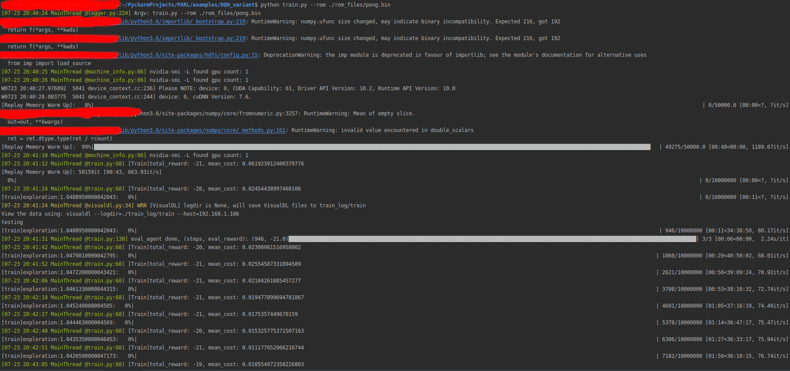
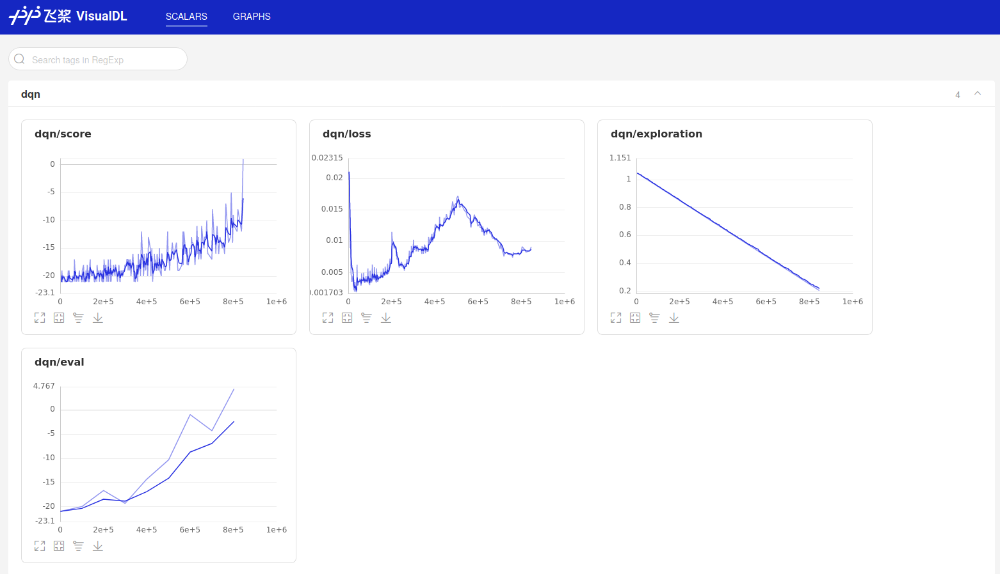
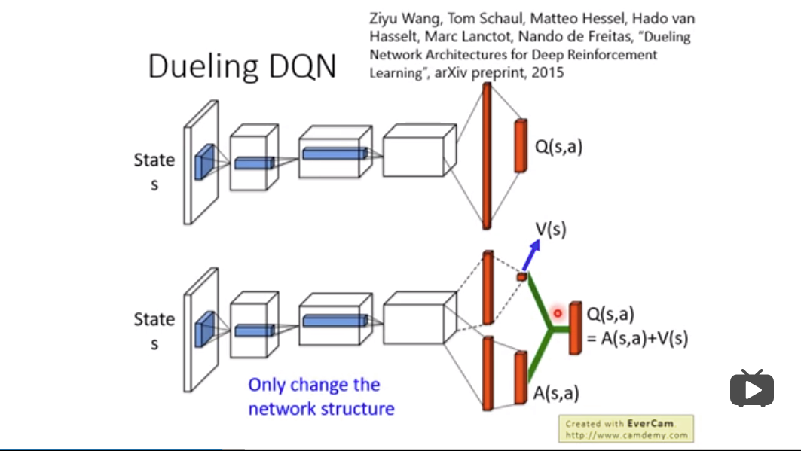

# 强化学习DQN及其变体原理与PARL实现

## Q-Learning知识点复习

`DQN`本质上是在`Q`网络上的更新，所以这里先复习`Q-Learning`这种策略选择方式的知识点。

`Q-Learning`也是采用`Q`表格的方式存储`Q`值（状态动作价值），决策部分与`Sarsa`是一样的，采用`ε-greedy`方式增加探索。

区别在于

- `Sarsa`是`on-policy`的更新方式，先做出动作再更新。
- `Q-Learning`是`off-policy`的更新方式，更新`learn()`时无需获取下一步实际做出的动作`next_action`，并假设下一步动作是取最大`Q`值的动作。

`Q-Learning`的更新公式是：


但是使用Q表格来存储每一个状态State, 和在这个State每个行为Action所拥有的Q值存在瓶颈——问题太复杂，状态特别多，不仅训练耗时，内存也装不下。

## DQN的两大利器

再回顾下`DQN`（Deep Q Network）的原理，本质上`DQN`还是一个`Q-learning`算法，更新方式一致。为了更好的探索环境，同样的也采用`ε-greedy`方法训练。


但是DQN论文引入了卷积神经网络，并提出两大利器，用于解决DL和RL结合时遇到的问题

- 经验回放 `Experience Replay`：主要解决样本关联性和利用效率的问题。使用一个经验池存储多条经验`s,a,r,s'`，再从中随机抽取一批数据送去训练。
- 固定Q目标 `Fixed-Q-Target`：主要解决算法训练不稳定的问题。复制一个和原来`Q`网络结构一样的`Target Q`网络，用于计算`Q`目标值。

### experience replay经验回放

经验池中的记忆库用来学习之前的经历，又因为`Q-learning`是一种 `off-policy`离线学习法, 它能学习当前经历着的, 也能学习过去经历过的, 甚至是学习别人的经历， 所以每次 DQN 更新的时候, 我们都可以随机抽取一些之前的经历进行学习。

为什么要随机抽取？因为状态的转移是连续的，四元组`s,a,r,s'`如果直接按顺序取一批四元组作为训练集，那么是容易过拟合的，因为训练样本间不是独立的！因此需要从经验池中随机抽取少量四元组作为一个batch，这样既保证了训练样本是**独立同分布**的，也使得每个batch**样本量不大**，能加快训练速度。

总结一下，随机抽取这种做法打乱了经历之间的相关性, 也使得神经网络更新更有效率。    

### Fixed-Q-Target目标网络

`Fixed-Q-Target`的作用其实也是一种打乱相关性的机制，使用`Fixed-Q-Target`会使得DQN中出现两个结构完全相同但是参数却不同的网络，预测Q估计的的网络MainNet使用的是最新的参数，而预测Q现实的神经网络TargetNet参数使用的却是很久之前的。

这也是为了防止过拟合。试想如果只有一个神经网络，那么它就在会不停地更新，那么它所追求的目标是在一直改变的，即在神经网络的参数改变的时候，不止Q(s, a)变了，max *Q(s’, a’)*也变了。这样的好处是一段时间里目标`Q`值使保持不变，一定程度降低了当前`Q`值和目标`Q`值的相关性，提高了算法稳定性。

## DQN算法具体流程


### DQN存在的过估计（overestimate）问题

`DQN`直接选取目标网络（Target Q Network）中下一个State各个Action对应的`Q`值最大的那一个`Q`值，并且会不断向下传递，导致`DQN`估计的`Q`值往往会偏大。`

### PARL代码

```python
class DQN(Algorithm):
    def __init__(self, model, act_dim=None, gamma=None, lr=None):
        """ DQN algorithm
        
        Args:
            model (parl.Model): model defining forward network of Q function
            act_dim (int): dimension of the action space
            gamma (float): discounted factor for reward computation.
            lr (float): learning rate.
        """
        # 一个Q网络，MainNet
        self.model = model
        # 复制的MainNet，结构完全一致的TargetNet
        self.target_model = copy.deepcopy(model)

        assert isinstance(act_dim, int)
        assert isinstance(gamma, float)

        # 可选action的个数
        self.act_dim = act_dim
        self.gamma = gamma
        self.lr = lr

    def predict(self, obs):
        """ use value model self.model to predict the action value
        """
        return self.model.value(obs)

    def learn(self,
              obs,
              action,
              reward,
              next_obs,
              terminal,
              learning_rate=None):
        """ update value model self.model with DQN algorithm
        """
        # Support the modification of learning_rate
        if learning_rate is None:
            assert isinstance(
                self.lr,
                float), "Please set the learning rate of DQN in initializaion."
            learning_rate = self.lr

        # Q估计
        pred_value = self.model.value(obs)
        # Q现实
        next_pred_value = self.target_model.value(next_obs)
        # 取Q值中最大的action
        best_v = layers.reduce_max(next_pred_value, dim=1)
        # 阻止梯度传递
        best_v.stop_gradient = True
        # 计算目标Q值
        target = reward + (
            1.0 - layers.cast(terminal, dtype='float32')) * self.gamma * best_v
		
        # 将action转为onehot向量，方便之后计算action对应的 Q(s,a)
        action_onehot = layers.one_hot(action, self.act_dim)
        action_onehot = layers.cast(action_onehot, dtype='float32')
        pred_action_value = layers.reduce_sum(
            layers.elementwise_mul(action_onehot, pred_value), dim=1)
        cost = layers.square_error_cost(pred_action_value, target)
        cost = layers.reduce_mean(cost)
        optimizer = fluid.optimizer.Adam(
            learning_rate=learning_rate, epsilon=1e-3)
        optimizer.minimize(cost)
        return cost
	
    # 以MainNet为基准，同步TargetNet的参数
    def sync_target(self):
        """ sync weights of self.model to self.target_model
        """
        self.model.sync_weights_to(self.target_model)
```





## Double DQN

`Double DQN`是`DQN`的一种改进，旨在解决DQN训练过程中存在的过估计（overestimate）问题。在训练过程中，`Double DQN`首先使用预测网络（Predict Q Network）计算下一个State的对应各个Action的`Q`值，然后选取最大的那个`Q`值对应Action的索引，再使用目标网络计算该状态的对应各个状态的Q值，然后选取预测网络中给定Action索引对应的Q值，但是它可能不是最大的那个，从而一定程度上避免了过度估计，提高了训练`DQN`的稳定性和速度。

这是一种相互督查的方法。如果只有一个`Q`网络，经常会过度估计。那就用两个`Q`网络，因为两个`Q`网络的参数有差别，所以对于同一个动作的评估也会有少许不同。我们选取评估出来较小的值来计算目标。这样就能避免`Q`网络过度估计的情况发生了。

实验结果也证明，`Double DQN`有效地防止了过度估计。


同时，`Double DQN`也需要用到两个`Q`网络。`Q1`网络**推荐**能够获得最大`Q`值的动作；`Q2`网络计算这个动作在`Q2`网络中的`Q`值。这时候，`Fixed-Q-Target`的网络结构刚好能派上用场，因此`Double DQN`对`DQN`的唯一的变化就在目标函数上：


### PARL代码

```python
class DDQN(Algorithm):
    def __init__(self, model, act_dim=None, gamma=None, lr=None):
        """ Double DQN algorithm
        Args:
            model (parl.Model): model defining forward network of Q function
            act_dim (int): dimension of the action space
            gamma (float): discounted factor for reward computation.
            lr (float): learning rate.
        """
        self.model = model
        self.target_model = copy.deepcopy(model)

        assert isinstance(act_dim, int)
        assert isinstance(gamma, float)

        self.act_dim = act_dim
        self.gamma = gamma
        self.lr = lr

    def predict(self, obs):
        """ use value model self.model to predict the action value
        """
        return self.model.value(obs)

    def learn(self,
              obs,
              action,
              reward,
              next_obs,
              terminal,
              learning_rate=None):
        """ update value model self.model with DQN algorithm
        """
        # Support the modification of learning_rate
        if learning_rate is None:
            assert isinstance(
                self.lr,
                float), "Please set the learning rate of DQN in initializaion."
            learning_rate = self.lr

        pred_value = self.model.value(obs)
        action_onehot = layers.one_hot(action, self.act_dim)
        action_onehot = layers.cast(action_onehot, dtype='float32')
        pred_action_value = layers.reduce_sum(
            layers.elementwise_mul(action_onehot, pred_value), dim=1)

        # choose acc. to behavior network
        next_action_value = self.model.value(next_obs)
        greedy_action = layers.argmax(next_action_value, axis=-1)

        # calculate the target q value with target network
        batch_size = layers.cast(layers.shape(greedy_action)[0], dtype='int64')
        range_tmp = layers.range(
            start=0, end=batch_size, step=1, dtype='int64') * self.act_dim
        a_indices = range_tmp + greedy_action
        a_indices = layers.cast(a_indices, dtype='int32')
        next_pred_value = self.target_model.value(next_obs)
        next_pred_value = layers.reshape(
            next_pred_value, shape=[
                -1,
            ])
        max_v = layers.gather(next_pred_value, a_indices)
        max_v = layers.reshape(
            max_v, shape=[
                -1,
            ])
        max_v.stop_gradient = True

        target = reward + (
            1.0 - layers.cast(terminal, dtype='float32')) * self.gamma * max_v
        cost = layers.square_error_cost(pred_action_value, target)
        cost = layers.reduce_mean(cost)
        optimizer = fluid.optimizer.Adam(
            learning_rate=learning_rate, epsilon=1e-3)
        optimizer.minimize(cost)
        return cost

    def sync_target(self):
        """ sync weights of self.model to self.target_model
        """
        self.model.sync_weights_to(self.target_model)
```

## Dueling DQN

`Dueling DQN`是一种网络结构上的创新，其将网络分成了两部分：**值函数** 和 **优势函数**。



图中将原有的`DQN`算法的网络输出分成了两部分，在数学上表示为：


其中， 表示网络结构，,表示两个全连接层网络的参数，由图和公式可知，仅与状态有关，而与状态和动作都有关。 如果仅仅用当前的这个公式更新的话，其存在一个“**unidentifiable**”问题（比如V和A分别加上和减去一个值能够得到同样的Q，但反过来显然无法由Q得到唯一的V和A）。作者为了解决它，作者强制优势函数估计量在选定的动作处具有**零优势**。 也就是说让网络的最后一个模块实现前向映射，表示为：


怎么理解呢？对于任意 来说，


那么我们可以得到： ，因此，提供了价值函数的估计，而另一个产生了优势函数的估计。在这里作者使用里**平均**（）代替了最大化操作，表示为：


采用这种方法，虽然使得值函数V和优势函数A不再完美的表示值函数和优势函数(在语义上的表示)，但是这种操作提高了稳定性。而且，并没有改变值函数V和优势函数A的本质表示。


在更新网络时，让模型更倾向于去更新V而不是更新A，这是一种比较有效率的做法。

### PARL代码

```python
class AtariModel(parl.Model):
    def __init__(self, act_dim, algo='DQN'):
        self.act_dim = act_dim

        self.conv1 = layers.conv2d(
            num_filters=32, filter_size=5, stride=1, padding=2, act='relu')
        self.conv2 = layers.conv2d(
            num_filters=32, filter_size=5, stride=1, padding=2, act='relu')
        self.conv3 = layers.conv2d(
            num_filters=64, filter_size=4, stride=1, padding=1, act='relu')
        self.conv4 = layers.conv2d(
            num_filters=64, filter_size=3, stride=1, padding=1, act='relu')

        self.algo = algo
        if algo == 'Dueling':
            # A(s,a)
            self.fc1_adv = layers.fc(size=512, act='relu')
            self.fc2_adv = layers.fc(size=act_dim)
            # V(s)
            self.fc1_val = layers.fc(size=512, act='relu')
            self.fc2_val = layers.fc(size=1)
        else:
            self.fc1 = layers.fc(size=act_dim)

    def value(self, obs):
        obs = obs / 255.0
        out = self.conv1(obs)
        out = layers.pool2d(
            input=out, pool_size=2, pool_stride=2, pool_type='max')
        out = self.conv2(out)
        out = layers.pool2d(
            input=out, pool_size=2, pool_stride=2, pool_type='max')
        out = self.conv3(out)
        out = layers.pool2d(
            input=out, pool_size=2, pool_stride=2, pool_type='max')
        out = self.conv4(out)
        out = layers.flatten(out, axis=1)

        if self.algo == 'Dueling':
            As = self.fc2_adv(self.fc1_adv(out))
            V = self.fc2_val(self.fc1_val(out))
            Q = As + (V - layers.reduce_mean(As, dim=1, keep_dim=True))
        else:
            Q = self.fc1(out)
        return Q
```

